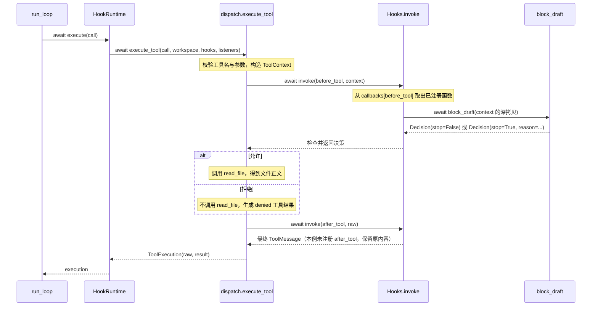
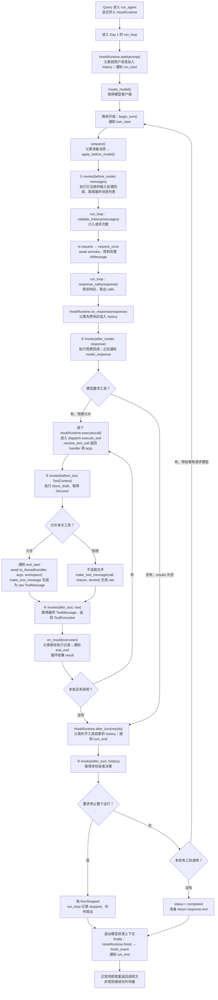

# Day 2：新增 Hooks、事件与工具调度

[总览](summary.md) · [固定基础代码](support.md)

**还不清楚 Hook 怎么执行时，先看本页末尾的 [Query → Hook → answer 调用图](#从-query-开始看-day-2-的函数调用)。先跟着一个回调走完，再看完整实现中的校验分支。**

## 核心问题

在已经完成的循环中加入权限检查、结果处理和事件，怎样不改循环源码？今天新增 Hooks 与调度实现，配套 HookRuntime 负责连接 Day 1 已经预留好的调用位置。

## 今天新增什么，哪些文件不动

**今天只新增：** `hooks.py`、`lifecycle.py`、`dispatch.py`、`hook_runtime.py`。每个文件的实现只在它所属的这一天给出。

**保留不动：** support.md 的固定基础文件及前面各天已完成的全部文件。今天不替换 app.py，不重新填写 run_agent/run_loop，不复制一份旧循环改名。

## 本日实现与边界

- hooks.py：按注册顺序 await，快照隔离，按五类 Hook 分别检查返回契约。
- lifecycle.py：观察性通知与控制决策分开；普通监听器错误不触发工具重放，取消传播。
- dispatch.py：预期工具错误转 failed，拒绝转 denied，Hook 错误不包装成工具失败；保留 raw 与最终结果。
- hook_runtime.py 是直接提供的接线代码，调用已有 Runtime 方法后加入 Hook/事件。新类扩展行为，不修改或重复实现 Runtime/run_loop。
- 五个 Hook 分别为 before_model、after_model、before_tool、after_tool、after_turn；before_model 仅能添加低优先级数据，after_model 只读，after_tool 不可改 ID/名称/状态。

## 先认识本日的类与函数

实际 callback 示例、context 的具体形状和 invoke 各分支见 [Hook 讲解](hooks-explained.md)。

| 类 | 它是什么 | 属性是什么意思 |
| --- | --- | --- |
| `Decision` | 回调返回的决策数据，不会自己停止程序 | `stop`：是否提出拒绝/停止，默认 False；`reason`：理由，stop=True 时须非空。before_tool 拒绝本次工具，after_turn 停止运行 |
| `ToolContext` | 执行工具前交给回调的数据 | `name`：工具名；`call_id`：本次调用编号；`args`：校验后的工具参数字典；read 的路径在 `args["path"]` 中 |
| `Hooks` | 保存并调用扩展函数的管理器 | `callbacks`：Hook 名 → 按注册顺序排列的函数列表，存的是函数本身 |
| `Event` | 一份事件通知 | `kind`：事件名；`detail`：补充说明；`call_id`：关联工具调用编号，不涉及工具时可为空 |
| `HookRuntime` | 继承 Runtime，在已有位置加入 Hook 和事件 | 新增 `hooks`：回调管理器；`listeners`：事件监听函数序列。继承属性见 [基础代码](support.md#先认识基础代码中的类与函数) |

Decision、ToolContext、Event 的 `@dataclass(frozen=True)` 自动生成初始化等方法，并禁止创建后直接重赋字段；它不是执行沙箱。`HookName` 是五种名称的类型别名；`HookContext` 和 `HookResult` 是几种输入/输出类型的联合别名，不是需要实例化的类。`Callback` 表示接收上下文、await 后取得 HookResult 的函数；`Listener` 表示接收 Event、await 后返回 None 的函数。每个 Hook 位置还有自己的具体返回限制。

| 函数或方法 | 输入、功能和返回值 |
| --- | --- |
| `Hooks.__init__()` | 创建 Hooks() 时自动执行，为五种 Hook 建立空列表 |
| `Hooks.register(name, callback)` | 检查名称并保存函数，此刻不执行回调；返回 None |
| `Hooks.invoke(name, context)` | 顺序 await 对应回调，每次传深拷贝；检查返回值，串联修改或提前交回拒绝决策；返回最终数据、Decision 或 None |
| `emit(event, listeners)` | 依次 await 监听器，不使用其返回值；普通异常记日志后继续，取消传播；返回 None |
| `finish_event(status, listeners)` | 用状态说明构造 run_end，在异步超时范围内发送；超时记日志，返回 None |
| `dispatch.execute_tool(call, workspace, hooks, listeners)` | 校验调用 → before_tool → 允许时读取 → after_tool；返回保留 raw/result 的 ToolExecution。拒绝不读取，Hook 错误向外传播 |
| `HookRuntime.__init__(...)` | 初始化父类，再保存 hooks/listeners；未提供 hooks 时创建空管理器 |
| `HookRuntime.start(prompt)` | 父类保存用户输入后发送 run_start；返回 None |
| `HookRuntime.begin_turn()` | 发送 turn_start；返回 None |
| `HookRuntime.apply_before_model(messages)` | 触发 before_model 并确认结果为列表，返回模型输入视图 |
| `HookRuntime.prepare()` | 取得父类准备的消息，再经 apply_before_model，返回处理后的列表 |
| `HookRuntime.on_response(response)` | 父类保存 AIMessage 后触发 after_model 和 model_response；返回 None |
| `HookRuntime.execute(call)` | 调用本日工具调度器，返回 ToolExecution |
| `HookRuntime.on_result(execution)` | 父类记录执行对象后发送 tool_end；返回 None |
| `HookRuntime.after_turn(results)` | 父类补齐历史后发送 turn_end，再触发 after_turn；停止决策抛 RunStopped，否则返回 None |
| `HookRuntime.finish(status, reason)` | 把终态和理由交给 finish_event，返回 None |

`context/current/result` 是 invoke 的局部变量：原始输入、目前认可的数据、当前回调待检查的返回值。它们不是 Hooks 属性，也不是三种新类。

## 完整练习骨架

导包、异常类、字段、初始化和辅助实现已给出，只填 TODO 函数体。NotImplementedError 是未完成提示；移除它并填写真实逻辑后再验收。骨架暂时关闭未使用导入提示，其他类型检查保持开启。

### src/zeta/hooks.py

只填写：`Hooks.invoke`、`Hooks.register`。

```python
# ruff: noqa: F401  # Prepared imports for exercise bodies.
# pyright: reportUnusedImport=false
from collections.abc import Awaitable, Callable
from copy import deepcopy
from dataclasses import dataclass
from typing import Any, Literal

from langchain_core.messages import (
    AIMessage,
    BaseMessage,
    HumanMessage,
    ToolMessage,
)

from zeta.loop_common import validate_history

type HookName = Literal[
    "before_model", "after_model", "before_tool", "after_tool", "after_turn"
]


@dataclass(frozen=True)
class Decision:
    stop: bool = False
    reason: str = ""


@dataclass(frozen=True)
class ToolContext:
    name: str
    call_id: str
    args: dict[str, Any]


type HookContext = list[BaseMessage] | AIMessage | ToolContext | ToolMessage
type HookResult = list[BaseMessage] | ToolMessage | Decision | None
type Callback = Callable[[HookContext], Awaitable[HookResult]]


class Hooks:
    def __init__(self) -> None:
        self.callbacks: dict[HookName, list[Callback]] = {
            name: []
            for name in (
                "before_model",
                "after_model",
                "before_tool",
                "after_tool",
                "after_turn",
            )
        }

    def register(self, name: HookName, callback: Callback) -> None:
        """TODO：拒绝未知名称，将回调追加到对应列表。"""
        raise NotImplementedError("请完成 Hooks.register")

    async def invoke(self, name: HookName, context: HookContext) -> HookResult:
        """TODO：
        1. 每次给回调深拷贝快照，逐个 await。
        2. 按 Hook 类型验证返回值及修改边界。
        3. 变换类串联新视图，决策类遇到 stop/deny 提前返回。
        4. 不吞掉 Hook 异常和取消。"""
        raise NotImplementedError("请完成 Hooks.invoke")
```

### src/zeta/lifecycle.py

只填写：`emit`、`finish_event`。

```python
# ruff: noqa: F401  # Prepared imports for exercise bodies.
# pyright: reportUnusedImport=false
import asyncio
import logging
from collections.abc import Awaitable, Callable, Sequence
from dataclasses import dataclass

logger = logging.getLogger(__name__)


@dataclass(frozen=True)
class Event:
    kind: str
    detail: str = ""
    call_id: str = ""


type Listener = Callable[[Event], Awaitable[None]]


async def emit(event: Event, listeners: Sequence[Listener]) -> None:
    """TODO：按本日契约实现 emit，写完与下方同名函数逐分支核对。"""
    raise NotImplementedError("请完成 emit")


async def finish_event(status: str, listeners: Sequence[Listener]) -> None:
    """TODO：按本日契约实现 finish_event，写完与下方同名函数逐分支核对。"""
    raise NotImplementedError("请完成 finish_event")
```

### src/zeta/dispatch.py

只填写：`execute_tool`。

```python
# ruff: noqa: F401  # Prepared imports for exercise bodies.
# pyright: reportUnusedImport=false
import asyncio
from collections.abc import Sequence
from copy import deepcopy
from pathlib import Path

from langchain_core.messages import ToolCall, ToolMessage

from zeta.hooks import Decision, Hooks, ToolContext
from zeta.lifecycle import Event, Listener, emit
from zeta.runtime_base import ToolExecution
from zeta.tools import ToolError, make_tool_message, resolve_tool_call


async def execute_tool(
    call: ToolCall,
    workspace: Path,
    hooks: Hooks,
    listeners: Sequence[Listener] = (),
) -> ToolExecution:
    """TODO：按本日契约实现 execute_tool，写完与下方同名函数逐分支核对。"""
    raise NotImplementedError("请完成 execute_tool")
```

### src/zeta/hook_runtime.py

直接提供的接入代码，原样使用；内部调用前面已完成的方法，不重新实现它们。

```python
from collections.abc import Sequence
from pathlib import Path

from langchain_core.messages import (
    AIMessage,
    BaseMessage,
    ToolCall,
    ToolMessage,
)

from zeta.dispatch import execute_tool
from zeta.hooks import Decision, Hooks
from zeta.lifecycle import Event, Listener, emit, finish_event
from zeta.loop_common import RunStopped
from zeta.runtime_base import ModelIO, RunOptions, RunStatus, Runtime, ToolExecution
from zeta.tools import tool_outcome


class HookRuntime(Runtime):
    def __init__(
        self,
        workspace: Path,
        *,
        hooks: Hooks | None = None,
        listeners: Sequence[Listener] = (),
        io: ModelIO | None = None,
        options: RunOptions | None = None,
    ) -> None:
        super().__init__(workspace, io=io, options=options)
        self.hooks = hooks if hooks is not None else Hooks()
        self.listeners = listeners

    async def start(self, prompt: str | None) -> None:
        await super().start(prompt)
        await emit(Event("run_start"), self.listeners)

    async def begin_turn(self) -> None:
        await emit(Event("turn_start"), self.listeners)

    async def apply_before_model(
        self, messages: list[BaseMessage]
    ) -> list[BaseMessage]:
        view = await self.hooks.invoke("before_model", messages)
        if not isinstance(view, list):
            raise TypeError("missing model input")
        return view

    async def prepare(self) -> list[BaseMessage]:
        return await self.apply_before_model(await super().prepare())

    async def on_response(self, response: AIMessage) -> None:
        await super().on_response(response)
        await self.hooks.invoke("after_model", response)
        await emit(Event("model_response"), self.listeners)

    async def execute(self, call: ToolCall) -> ToolExecution:
        return await execute_tool(call, self.workspace, self.hooks, self.listeners)

    async def on_result(self, execution: ToolExecution) -> None:
        await super().on_result(execution)
        await emit(
            Event(
                "tool_end",
                tool_outcome(execution.result),
                execution.result.tool_call_id,
            ),
            self.listeners,
        )

    async def after_turn(self, results: list[ToolMessage]) -> None:
        await super().after_turn(results)
        await emit(Event("turn_end"), self.listeners)
        decision = await self.hooks.invoke("after_turn", self.history)
        if isinstance(decision, Decision) and decision.stop:
            raise RunStopped(decision.reason)

    async def finish(self, status: RunStatus, reason: str) -> None:
        await finish_event(f"{status}: {reason}", self.listeners)
```

## 怎样核对

用 `run_agent(prompt, workspace, runtime=HookRuntime(workspace, hooks=你的策略))` 调用同一入口。注册实际路径拒绝策略，观察 denied 不执行；成功读取时核对 Hook 与事件顺序。拒绝也有 tool_end，只有实际执行才有 tool_start。

不新增测试、mock、fixture 或内联自测。代码静态检查与实际模型/故障验收分开记录。

## 完整参考答案

答案只针对本日新增文件。前面各天的答案是被复用的依赖，不在这里再给修改版。

<details>
<summary>参考答案：src/zeta/hooks.py（完整文件）</summary>

```python
from collections.abc import Awaitable, Callable
from copy import deepcopy
from dataclasses import dataclass
from typing import Any, Literal

from langchain_core.messages import (
    AIMessage,
    BaseMessage,
    HumanMessage,
    ToolMessage,
)

from zeta.loop_common import validate_history

type HookName = Literal[
    "before_model", "after_model", "before_tool", "after_tool", "after_turn"
]


@dataclass(frozen=True)
class Decision:
    stop: bool = False
    reason: str = ""


@dataclass(frozen=True)
class ToolContext:
    name: str
    call_id: str
    args: dict[str, Any]


type HookContext = list[BaseMessage] | AIMessage | ToolContext | ToolMessage
type HookResult = list[BaseMessage] | ToolMessage | Decision | None
type Callback = Callable[[HookContext], Awaitable[HookResult]]


class Hooks:
    def __init__(self) -> None:
        self.callbacks: dict[HookName, list[Callback]] = {
            name: []
            for name in (
                "before_model",
                "after_model",
                "before_tool",
                "after_tool",
                "after_turn",
            )
        }

    def register(self, name: HookName, callback: Callback) -> None:
        if name not in self.callbacks:
            raise ValueError("unknown hook")
        self.callbacks[name].append(callback)

    async def invoke(self, name: HookName, context: HookContext) -> HookResult:
        if name not in self.callbacks:
            raise ValueError("unknown hook")
        current = deepcopy(context)
        for callback in self.callbacks[name]:
            result = await callback(deepcopy(current))
            if result is None:
                continue
            # 按常见生命周期顺序排列；每次 invoke 只处理 name 指定的 Hook。
            if name == "before_model":
                if not isinstance(current, list) or not isinstance(result, list):
                    raise TypeError("before_model must return a message list")
                if not current or len(result) < len(current):
                    raise ValueError("hook cannot remove the prepared context")
                if result[-len(current) :] != current:
                    raise ValueError("hook cannot rewrite prepared messages")
                for message in result[: -len(current)]:
                    if (
                        not isinstance(message, HumanMessage)
                        or not isinstance(message.content, str)
                        or not message.content.strip()
                    ):
                        raise ValueError(
                            "hook may only prepend user-level context data"
                        )
                validate_history(result)
                current = deepcopy(result)
            elif name == "after_model":
                # None 已在上面处理；观察回调不能返回替换数据。
                raise TypeError("after_model is read-only and must return None")
            elif name == "before_tool":
                if not isinstance(result, Decision):
                    raise TypeError("decision hook must return Decision")
                if result.stop:
                    if not result.reason.strip():
                        raise ValueError("a stop/deny decision needs a reason")
                    return result
            elif name == "after_tool":
                if not isinstance(current, ToolMessage) or not isinstance(
                    result, ToolMessage
                ):
                    raise TypeError("after_tool must return a tool result")
                if (
                    result.name,
                    result.tool_call_id,
                    result.status,
                    result.artifact,
                ) != (
                    current.name,
                    current.tool_call_id,
                    current.status,
                    current.artifact,
                ):
                    raise ValueError("hook changed tool result identity or outcome")
                current = deepcopy(result)
            elif name == "after_turn":
                if not isinstance(result, Decision):
                    raise TypeError("decision hook must return Decision")
                if result.stop:
                    if not result.reason.strip():
                        raise ValueError("a stop/deny decision needs a reason")
                    return result
        if name in ("before_tool", "after_turn"):
            return Decision()
        if name == "after_model":
            return None
        if isinstance(current, (list, ToolMessage)):
            return current
        raise TypeError("invalid hook context")
```

</details>

<details>
<summary>参考答案：src/zeta/lifecycle.py（完整文件）</summary>

```python
import asyncio
import logging
from collections.abc import Awaitable, Callable, Sequence
from dataclasses import dataclass

logger = logging.getLogger(__name__)


@dataclass(frozen=True)
class Event:
    kind: str
    detail: str = ""
    call_id: str = ""


type Listener = Callable[[Event], Awaitable[None]]


async def emit(event: Event, listeners: Sequence[Listener]) -> None:
    for listener in tuple(listeners):
        try:
            await listener(event)
        except Exception as error:  # noqa: BLE001 - intentional isolation or cleanup
            logger.warning("event listener failed: %s", type(error).__name__)


async def finish_event(status: str, listeners: Sequence[Listener]) -> None:
    try:
        async with asyncio.timeout(1.0):
            await emit(Event("run_end", status), listeners)
    except TimeoutError:
        logger.warning("run_end listeners timed out")
```

</details>

<details>
<summary>参考答案：src/zeta/dispatch.py（完整文件）</summary>

```python
import asyncio
from collections.abc import Sequence
from copy import deepcopy
from pathlib import Path

from langchain_core.messages import ToolCall, ToolMessage

from zeta.hooks import Decision, Hooks, ToolContext
from zeta.lifecycle import Event, Listener, emit
from zeta.runtime_base import ToolExecution
from zeta.tools import ToolError, make_tool_message, resolve_tool_call


async def execute_tool(
    call: ToolCall,
    workspace: Path,
    hooks: Hooks,
    listeners: Sequence[Listener] = (),
) -> ToolExecution:
    raw: ToolMessage
    try:
        handler, args = resolve_tool_call(call)
    except ToolError as error:
        raw = make_tool_message(call, str(error), "failed")
    else:
        decision = await hooks.invoke(
            "before_tool",
            ToolContext(call["name"], (call["id"] or ""), args.model_dump(mode="json")),
        )
        if not isinstance(decision, Decision):
            raise TypeError("missing tool decision")
        if decision.stop:
            raw = make_tool_message(call, decision.reason, "denied")
        else:
            await emit(Event("tool_start", call["name"], (call["id"] or "")), listeners)
            try:
                content = await asyncio.to_thread(handler, args, workspace)
            except ToolError as error:
                raw = make_tool_message(call, str(error), "failed")
            else:
                raw = make_tool_message(call, content)
    result = await hooks.invoke("after_tool", raw)
    if not isinstance(result, ToolMessage):
        raise TypeError("missing final tool result")
    return ToolExecution(deepcopy(raw), deepcopy(result))
```

</details>

<details>
<summary>参考答案：src/zeta/hook_runtime.py（完整文件）</summary>

```python
from collections.abc import Sequence
from pathlib import Path

from langchain_core.messages import (
    AIMessage,
    BaseMessage,
    ToolCall,
    ToolMessage,
)

from zeta.dispatch import execute_tool
from zeta.hooks import Decision, Hooks
from zeta.lifecycle import Event, Listener, emit, finish_event
from zeta.loop_common import RunStopped
from zeta.runtime_base import ModelIO, RunOptions, RunStatus, Runtime, ToolExecution
from zeta.tools import tool_outcome


class HookRuntime(Runtime):
    def __init__(
        self,
        workspace: Path,
        *,
        hooks: Hooks | None = None,
        listeners: Sequence[Listener] = (),
        io: ModelIO | None = None,
        options: RunOptions | None = None,
    ) -> None:
        super().__init__(workspace, io=io, options=options)
        self.hooks = hooks if hooks is not None else Hooks()
        self.listeners = listeners

    async def start(self, prompt: str | None) -> None:
        await super().start(prompt)
        await emit(Event("run_start"), self.listeners)

    async def begin_turn(self) -> None:
        await emit(Event("turn_start"), self.listeners)

    async def apply_before_model(
        self, messages: list[BaseMessage]
    ) -> list[BaseMessage]:
        view = await self.hooks.invoke("before_model", messages)
        if not isinstance(view, list):
            raise TypeError("missing model input")
        return view

    async def prepare(self) -> list[BaseMessage]:
        return await self.apply_before_model(await super().prepare())

    async def on_response(self, response: AIMessage) -> None:
        await super().on_response(response)
        await self.hooks.invoke("after_model", response)
        await emit(Event("model_response"), self.listeners)

    async def execute(self, call: ToolCall) -> ToolExecution:
        return await execute_tool(call, self.workspace, self.hooks, self.listeners)

    async def on_result(self, execution: ToolExecution) -> None:
        await super().on_result(execution)
        await emit(
            Event(
                "tool_end",
                tool_outcome(execution.result),
                execution.result.tool_call_id,
            ),
            self.listeners,
        )

    async def after_turn(self, results: list[ToolMessage]) -> None:
        await super().after_turn(results)
        await emit(Event("turn_end"), self.listeners)
        decision = await self.hooks.invoke("after_turn", self.history)
        if isinstance(decision, Decision) and decision.stop:
            raise RunStopped(decision.reason)

    async def finish(self, status: RunStatus, reason: str) -> None:
        await finish_event(f"{status}: {reason}", self.listeners)
```

</details>

## LangChain 类型对应关系

before_model 的列表改为 BaseMessage 序列，只能前置非空 HumanMessage 参考资料，不能改已有消息或插入 SystemMessage。after_tool 使用 ToolMessage，name、tool_call_id、status 和 artifact 都保持原值，只有正文可以处理。ToolCall 的 args 已是字典，由注册工具的 Pydantic 参数模型校验；read 对应 ReadArgs。

## 与前后单元的关系

Day 3 用新的 SessionRuntime 包装持久化，仍调用本日 HookRuntime；本日 hooks.py、dispatch.py、lifecycle.py 不修改。

## 从 Query 开始看 Day 2 的函数调用

本节对照本日参考答案与当前函数接线说明执行顺序；示例响应是数据流推演，没有发出真实模型请求。

**Hook 就是你写的普通异步函数。程序走到约定位置时调用它，拿到返回值后继续执行。** 例如“读取工具执行前，先检查本次任务是否允许读这份文件”。Day 2 加入的 Hook 管理器负责保存和调用这些函数。

先把三个名称对应起来：

| 名称 | 本例中的实际东西 |
| --- | --- |
| Hook 位置 | `"before_tool"`，表示工具执行前这个接入位置 |
| Hook 回调 | 你写的 `block_draft(context)` 普通异步函数 |
| Hook 管理器 | `hooks = Hooks()`；`register` 保存函数，`invoke` 调用函数 |

### 1. 先只看一个 Hook：读取前执行自定义规则

假设这次任务要求“可以读 README，但不要读名为 draft.txt 的草稿”。这条任务规则由你写进回调；工具原有的路径和大小检查仍由 `read_file` 执行。

```python
from pathlib import Path

from zeta.app import run_agent
from zeta.hook_runtime import HookRuntime
from zeta.hooks import Decision, HookContext, Hooks, ToolContext


async def block_draft(context: HookContext) -> Decision:
    if not isinstance(context, ToolContext):
        raise TypeError("block_draft needs ToolContext")
    if context.name == "read" and Path(context.args["path"]).name == "draft.txt":
        return Decision(stop=True, reason="本次任务不读取草稿")
    return Decision()  # 默认 stop=False，允许继续。


async def ask_with_policy(prompt: str, workspace: Path) -> str:
    hooks = Hooks()
    hooks.register("before_tool", block_draft)
    runtime = HookRuntime(workspace, hooks=hooks)
    return await run_agent(prompt, workspace, runtime=runtime)
```

这是调用接线示例，不是自动运行或自测代码；`ask_with_policy` 是本节为展示用法定义的入口，不是项目里原有的函数。模型配置沿用基础接入层。

`register` 保存的是 **`block_draft` 函数本身**，没有加括号。这一步之后，管理器里的数据相当于：

```text
hooks.callbacks = {
    "before_model": [],
    "after_model": [],
    "before_tool": [block_draft],
    "after_tool": [],
    "after_turn": [],
}
```

注册时既没有 Query 对应的工具调用，也没有执行路径检查。直到模型请求读取文件，才发生下面的调用：



当路径是 `README.md` 时，`block_draft` 返回 `Decision()`；当路径是 `draft.txt` 时，返回 `Decision(stop=True, reason=...)`。

**Decision 只是数据。真正决定是否调用 `read_file` 的，是调度器中的 `if decision.stop` 分支。** 同样，字符串 `"before_tool"` 只是管理器查找列表的键；函数不会因为名字含有 before 就自动运行。

### 2. 为什么原来的 run_loop 不改，也能调用到 Hook

Day 1 把 `Runtime` 对象交给循环；Day 2 显式把 `HookRuntime` 对象交给同一个循环。循环仍然执行 `await runtime.prepare()`，但此时进入的是子类 `HookRuntime.prepare`。

```text
run_loop: await runtime.prepare()
  └─ HookRuntime.prepare()
       ├─ await super().prepare()
       │    └─ Runtime.prepare()：得到系统指令 + history 副本
       └─ await self.apply_before_model(messages)
            └─ await self.hooks.invoke("before_model", messages)
                 └─ 逐个 await 这个位置已经注册的回调
            └─ 返回处理后的 messages
       └─ 返回给 run_loop 的 messages 变量
```

`super().prepare()` 复用父类已有的消息准备逻辑，使用的仍是同一个对象里的 `history`。随后子类显式调用 `invoke`，补上扩展行为。

**必须传入这个对象，图中的 Hook 才会接上。** 当前 `cli.main()` 默认调用 `run_agent(prompt, workspace)`，没有传 `runtime`，所以仍会创建基础 `Runtime`。创建了 `hooks.py` 或 `hook_runtime.py` 文件，并不等于默认 CLI 已启用 Hook。也必须把保存了回调的同一个 `hooks` 对象传给 `HookRuntime`。

### 3. 把五个 Hook 放回完整 Query 流程

下面假设 Query 是“用 read 读取 README.md 并概括目标”，已按本节示例注册 `block_draft` 并传入 `HookRuntime`。先看正常处理路径；图中将消息校验和预算检查保留为简短步骤，事件通知在下一节单独对照。



本例只注册了 `before_tool` 回调，所以其他四个位置仍会调用 `invoke`，但对应列表为空，直接返回默认结果。图中的五个位置不代表需要写五个回调。

若模型第一轮要求读取、第二轮直接回答，则实际触发顺序为：

```text
第一轮：before_model → 模型请求 → after_model
                     → before_tool → 文件读取 → after_tool → after_turn

第二轮：before_model → 模型请求 → after_model → after_turn → 返回答案
```

第二轮没有工具调用，所以不会经过 `before_tool` 和 `after_tool`。它能概括 README，是因为第一轮 `after_turn` 已把文件正文加入 `history`，随后第二轮 `prepare` 把正文包含进了模型输入。

工具名或参数校验失败时，调度器直接生成 `failed` 结果，跳过 `before_tool` 和文件读取，但仍经过 `after_tool`。实际读取抛出预期的 `ToolError` 时，也生成 `failed` 结果。Hook 自身抛错则向外传播，不包装成普通工具失败。

### 4. 五个位置分别把什么交给你，返回值又交给谁

| Hook 位置 | 你写的回调收到什么 | 回调允许返回什么 | invoke 的结果由谁使用 |
| --- | --- | --- | --- |
| `before_model` | 本轮消息列表的副本 | 增加了前置参考资料的新列表，或 None | `apply_before_model → prepare → run_loop` 将最终列表交给模型请求 |
| `after_model` | 已保存的完整 AIMessage 的副本 | 只能 None | `on_response` 等观察回调完成后继续，不替换模型响应 |
| `before_tool` | ToolContext：工具名、调用 ID、待读路径 | Decision，或 None | `dispatch.execute_tool` 根据最终决策执行或拒绝当前工具 |
| `after_tool` | 原始 ToolMessage 的副本，可能是成功、失败或拒绝 | 处理后的 ToolMessage，或 None | `dispatch.execute_tool` 将最终结果放进 ToolExecution.result，之后由循环写入历史 |
| `after_turn` | 已补齐本轮结果的完整 history 副本 | Decision，或 None | `HookRuntime.after_turn` 根据停止决策抛 RunStopped，或返回循环继续处理 |

这份实现对数据修改作了限制：`before_model` 只允许前置非空 `HumanMessage` 资料，不改变既有消息，也不会自动把新资料写入 `history`；`after_tool` 保留名称、调用 ID、状态和 artifact，可以处理正文。它同时保留 `raw`，所以处理 `result` 并不删除原始记录。

`invoke` 内部的主干可以读成下面四步，先不被类型和深拷贝判断打断：

```text
按 name 找到回调列表
  → 按注册顺序逐个 await callback(context 的副本)
  → 检查返回值是否符合这个位置的规则
  → 返回最终数据、停止决策，或者默认结果
```

具体来说：

- `before_model` / `after_tool`：一个回调返回的新数据经过检查后，成为下一个回调的输入；返回 None 表示不提交改动。即使回调修改了收到的副本，返回 None 也不会把修改采用到主流程中。
- `before_tool` / `after_turn`：有人返回 `Decision(stop=True, reason=...)` 就提前返回决策，不再调用这个位置后面的回调；否则最后返回 `Decision()`。
- `after_model`：依次等待观察回调，最后返回 None。
- 没注册回调：前两种变换位置返回输入副本；两个决策位置返回 `Decision()`；`after_model` 返回 None。

**同一个 `Decision(stop=True)` 在两个位置的作用不同：`before_tool` 只拒绝当前工具；`after_turn` 才停止整个运行。** 被拒绝的工具仍生成可配对的结果，其他调用或后续模型请求可以继续。

### 5. emit、finish_event 和 Hook 有什么区别

Hook 的返回值可以参与决策或改变被采用的数据；Event 用来通知监听器发生了什么。`emit` 会等待监听函数，但不会把监听器返回值拿来判断是否允许读文件。

| 从哪里调用 | 具体执行顺序 |
| --- | --- |
| `HookRuntime.start` | `Runtime.start` 保存 Query → `emit(run_start)` |
| `HookRuntime.begin_turn` | `emit(turn_start)` |
| `HookRuntime.on_response` | `Runtime.on_response` 保存响应 → `invoke(after_model)` → `emit(model_response)` |
| `dispatch.execute_tool` 的允许分支 | `invoke(before_tool)` 放行 → `emit(tool_start)` → `read_file` |
| `HookRuntime.on_result` | `Runtime.on_result` 保存 execution → `tool_outcome(result)` 得到状态标签 → `emit(tool_end)` |
| `HookRuntime.after_turn` | `Runtime.after_turn` 补齐结果 → `emit(turn_end)` → `invoke(after_turn)` |
| `HookRuntime.finish` | `finish_event(status)` → 在 1 秒超时范围内 `emit(run_end)` |

`emit(event, listeners)` 逐个 `await listener(event)`；普通监听器异常只记录警告并继续，取消仍向外传播。`finish_event` 用状态文字构造 `run_end`，并为这次结束通知设置超时。这里使用的是 `lifecycle.Event`，没有经过 `events.py` 中的 `ZetaEvent` 或 `event_to_json`。

因此，拒绝读取时没有 `tool_start`，但有结果可记录，所以仍有 `tool_end`。通知发出了，也不等于终端自动出现日志；只有配置了会显示或记录通知的监听器，才有对应输出。

Hook 的实际用途是让不同运行采用不同规则：这次注册“拒绝草稿”，下次可以注册另一条业务检查；仍由同一个 `run_loop` 和调度器负责请求模型、执行工具和回传结果。如果只有一条永远不变的规则，直接写在工具函数里也可以，Hook 并不是 Agent 能运行的前提。


## 扩展工具：普通函数与一张显式表

具体工具各自放在 `src/zeta/builtin_tools/` 下，保留参数模型和普通执行函数，不需要装饰器。
在 `src/zeta/tools.py` 导入它们，再写入 `TOOLS`：

```python
TOOLS: dict[str, tuple[type[BaseModel], ToolHandler]] = {
    "read": (ReadArgs, read_file),
}
```

字典键是模型使用的工具名；值是一对对象：参数模型类和执行函数。
`ReadArgs`、`read_file` 都不加括号，此处只是保存它们，不会校验参数或读取文件。
新增工具时，在表中使用新的名称，配对对应的参数模型与函数即可。
这是本地显式配置，不再执行装饰器注册检查；函数文档字符串提供模型说明，没有文档字符串时使用工具名。

`tool_schemas()` 遍历表，生成名称、描述和参数 schema。
`resolve_tool_call(call)` 按名称取出 `args_model, handler`，执行
`args_model.model_validate(call["args"])` 后返回 `handler, args`。
基础执行器随后调用 `handler(args, workspace)`；Hook 调度器先执行 `before_tool`，
允许后通过 `asyncio.to_thread(handler, args, workspace)` 调用同一个函数。

未知工具或参数无效仍抛出 `ToolError`；基础入口向外传递，Hook 入口转为失败结果。
名称或参数校验失败时跳过 `before_tool`；参数错误、拒绝、执行失败和成功四条路径最终都把 raw 交给 `after_tool`。
`make_tool_message(call, content, outcome)` 统一保留名称和调用 ID，并转换
`success`、`failed`、`denied` 对应的消息状态与附加信息。

`ToolError` 定义在 `builtin_tools/__init__.py`，具体工具和调度层共用。
`tools.py` 导入它，原有 `from zeta.tools import ToolError` 仍可使用。
包初始化无需导入所有工具；`tools.py` 加载时直接建立这张表。
