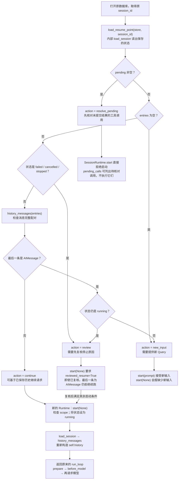

# Day 3：新增 Session 持久化与恢复

[总览](summary.md) · [固定基础代码](support.md)

**先看本页末尾的 [Query → 保存消息 → 恢复运行调用图](#从-query-开始看-day-3-的函数调用)。沿用 Day 1、Day 2 的读取 README 示例，先理解何时保存，再看恢复判断。**

## 核心问题

如何持久化完整事实、识别未完成批次并安全恢复？只写 Session 策略；配套 SessionRuntime 在提交后调用 Day 2 的处理，不复制 Loop、Hook 或工具实现。

## 今天新增什么，哪些文件不动

**今天只新增：** `session.py`、`session_runtime.py`。每个文件的实现只在它所属的这一天给出。

**保留不动：** support.md 的固定基础文件及前面各天已完成的全部文件。今天不替换 app.py，不重新填写 run_agent/run_loop，不复制一份旧循环改名。

## 本日实现与边界

- Session 中保留稳定 entry_id、有序 entries、pending、scope 和终态，存储底层使用 support.md 的 JsonStore。
- commit_response 保存完整响应和 pending，但不能提前把 run 标为 completed；最后 Hook 仍可能失败。
- commit_tool_result 同事务保存 raw/result 并移除 pending，重复或错配结果拒绝。
- history_messages 将逐项保存的工具结果重组成完整批次；load_resume_point 只返回恢复决策，不自动执行调用。
- session_runtime.py 直接提供：先提交，再调用 HookRuntime 已有行为。未取得该 run 的处理权时，拒绝恢复不会改写原 Session 状态。

## 先认识本日的类与函数

Session 保存对话事实，Entry 是其中的一条记录。继承 Pydantic BaseModel 的数据类可校验字段、转换 JSON，但创建对象不会自动写入数据库。

| 类 | 它是什么 | 属性是什么意思 |
| --- | --- | --- |
| `Entry` | 一条消息的存储记录 | `id`：记录编号，不是工具调用 ID；`message_json`：最终消息 JSON 字符串；`raw_json`：可选工具原始消息 JSON；`timestamp`：UTC 创建时间 |
| `SessionData` | 整段会话的存储状态 | `id`：会话编号；`scope`：访问范围；`entries`：有序记录；`pending`：尚欠结果的调用 ID → 工具名；`status`：ready/running/completed/stopped/failed/cancelled；`reason`：状态说明；`memory_ids`：关联记忆编号列表 |
| `ResumePoint` | 读取会话后的恢复判断 | `session`：SessionData；`action`：new_input 要新输入、continue 可继续、resolve_pending 要先处理未完成调用、review 要先复核 |
| `SessionRuntime` | 继承 HookRuntime，为运行加入持久化 | 新增 `database`：JsonStore；`session_id`：目标会话；`allowed_scopes`：允许范围集合；`reviewed_resume`：调用方是否已复核恢复；`owns_run`：本对象是否已成功接管运行，决定能否在收尾时更新会话状态 |

继承的 hooks/listeners 见 [Day 2](day2.md#先认识本日的类与函数)，history/executions/io/options/started 等见 [基础代码](support.md#先认识基础代码中的类与函数)。`Field(default_factory=...)` 为每个新对象分别生成编号、时间或空集合，避免共享可变列表。

| 函数或方法 | 输入、功能和返回值 |
| --- | --- |
| `encode(messages)` | 把消息序列编码为带格式标记的 JSON 字符串，不落库 |
| `decode(entry)` | 读取 message_json，检查格式且恰好包含一条消息，返回 BaseMessage 的具体子类对象 |
| `load_session(store, session_id)` | 读取并校验会话，返回 SessionData；不存在则抛 KeyError |
| `save_session(store, session)` | 写入 SessionData 的 JSON，事务由外层管理；返回 None |
| `create_session(store, scope)` | 检查范围，在事务中创建空会话，返回会话 ID |
| `append_user(store, session_id, prompt)` | 检查上一任务已结束且无 pending，追加用户消息并设为 running，返回 Entry ID |
| `commit_response(store, session_id, response)` | 校验并保存 AIMessage，登记工具调用到 pending，返回 Entry ID |
| `commit_tool_result(store, session_id, result, raw)` | 检查 raw/result 身份一致且调用仍 pending，保存消息并核销调用，返回 Entry ID；raw 缺省时使用 result |
| `finish_session(store, session_id, status, reason)` | 保存终态和理由，有 pending 时不允许 completed；返回 None |
| `history_messages(entries)` | 按顺序解码并验证工具配对，返回消息列表 |
| `load_resume_point(store, session_id)` | 综合 pending、最后消息和状态，返回 ResumePoint，不执行恢复或重放工具 |
| `pending_calls(session)` | 从最近模型响应提取仍在 pending 的 ToolCall，返回列表 |
| `SessionRuntime.__init__(...)` | 初始化父类，保存数据库、范围和恢复选项，owns_run 初始为 False |
| `SessionRuntime.start(prompt)` | 校验权限和恢复条件，追加输入或接管任务，重建 history 并发送 run_start；返回 None |
| `SessionRuntime.on_response(response)` | 先持久化响应，再执行父类保存和观察逻辑；返回 None |
| `SessionRuntime.on_result(execution)` | 先持久化 raw/result，再执行父类记录和事件逻辑；返回 None |
| `SessionRuntime.finish(status, reason)` | 已接管运行才保存终态，finally 中仍执行父类结束通知；返回 None |

## 完整练习骨架

导包、异常类、字段、初始化和辅助实现已给出，只填 TODO 函数体。NotImplementedError 是未完成提示；移除它并填写真实逻辑后再验收。骨架暂时关闭未使用导入提示，其他类型检查保持开启。

### src/zeta/session.py

只填写：`append_user`、`commit_response`、`commit_tool_result`、`finish_session`、`history_messages`、`load_resume_point`。

```python
# ruff: noqa: F401  # Prepared imports for exercise bodies.
# pyright: reportUnusedImport=false
import json
from collections.abc import Sequence
from datetime import UTC, datetime
from typing import Any, Literal
from uuid import uuid4

from langchain_core.messages import (
    AIMessage,
    BaseMessage,
    HumanMessage,
    ToolCall,
    ToolMessage,
    messages_from_dict,
    messages_to_dict,
)
from pydantic import BaseModel, Field, TypeAdapter

from zeta.loop_common import response_calls, validate_history
from zeta.storage import JsonStore


class Entry(BaseModel):
    id: str = Field(default_factory=lambda: uuid4().hex)
    message_json: str
    raw_json: str | None = None
    timestamp: str = Field(default_factory=lambda: datetime.now(UTC).isoformat())


class SessionData(BaseModel):
    id: str
    scope: str
    entries: list[Entry] = Field(default_factory=list[Entry])
    pending: dict[str, str] = Field(default_factory=dict)
    status: Literal[
        "ready", "running", "completed", "stopped", "failed", "cancelled"
    ] = "ready"
    reason: str = ""
    memory_ids: list[str] = Field(default_factory=list[str])


def encode(messages: Sequence[BaseMessage]) -> str:
    return json.dumps(
        {"format": "langchain-messages-v1", "messages": messages_to_dict(messages)},
        ensure_ascii=False,
    )


def decode(entry: Entry) -> BaseMessage:
    payload = TypeAdapter(dict[str, Any]).validate_json(entry.message_json)
    if payload.get("format") != "langchain-messages-v1":
        raise ValueError(
            "unsupported message format; old sessions need explicit migration"
        )
    data = TypeAdapter(list[dict[str, Any]]).validate_python(payload["messages"])
    messages = messages_from_dict(data)
    if len(messages) != 1:
        raise ValueError("an entry must contain exactly one message")
    return messages[0]


def load_session(store: JsonStore, session_id: str) -> SessionData:
    body = store.get("session", session_id)
    if body is None:
        raise KeyError("unknown session")
    return SessionData.model_validate_json(body)


def save_session(store: JsonStore, session: SessionData) -> None:
    store.put("session", session.id, session.model_dump_json())


def create_session(store: JsonStore, scope: str) -> str:
    if not scope.strip():
        raise ValueError("scope is required")
    session = SessionData(id=uuid4().hex, scope=scope)
    with store.transaction():
        save_session(store, session)
    return session.id


def append_user(store: JsonStore, session_id: str, prompt: str) -> str:
    """TODO：按本日契约实现 append_user，写完与下方同名函数逐分支核对。"""
    raise NotImplementedError("请完成 append_user")


def commit_response(store: JsonStore, session_id: str, response: AIMessage) -> str:
    """TODO：
    1. 校验响应并加载运行中的 Session。
    2. 拒绝 pending 未清或上一条不是请求的状态。
    3. 在同一事务追加完整响应和 pending，不提前标完成。"""
    raise NotImplementedError("请完成 commit_response")


def commit_tool_result(
    store: JsonStore,
    session_id: str,
    result: ToolMessage,
    raw: ToolMessage | None = None,
) -> str:
    """TODO：
    1. 校验 raw/result 的 ID、名称和状态一致。
    2. 确认调用仍在 pending，拒绝重复提交。
    3. 保存原始及最终结果，移除 pending 并提交事务。"""
    raise NotImplementedError("请完成 commit_tool_result")


def finish_session(
    store: JsonStore,
    session_id: str,
    status: Literal["completed", "stopped", "failed", "cancelled"],
    reason: str = "",
) -> None:
    """TODO：按本日契约实现 finish_session，写完与下方同名函数逐分支核对。"""
    raise NotImplementedError("请完成 finish_session")


def history_messages(entries: Sequence[Entry]) -> list[BaseMessage]:
    """TODO：按本日契约实现 history_messages，写完与下方同名函数逐分支核对。"""
    raise NotImplementedError("请完成 history_messages")


class ResumePoint(BaseModel):
    session: SessionData
    action: Literal["new_input", "continue", "resolve_pending", "review"]


def load_resume_point(store: JsonStore, session_id: str) -> ResumePoint:
    """TODO：
    1. 加载 Session，优先识别 pending。
    2. 区分新输入、可续接、需处理调用及需人工复核。
    3. 只返回恢复决策，不执行工具或模型。"""
    raise NotImplementedError("请完成 load_resume_point")


def pending_calls(session: SessionData) -> list[ToolCall]:
    for entry in reversed(session.entries):
        message = decode(entry)
        if isinstance(message, AIMessage):
            return [
                call
                for call in response_calls(message)
                if (call["id"] or "") in session.pending
            ]
    return []
```

### src/zeta/session_runtime.py

直接提供的接入代码，原样使用；内部调用前面已完成的方法，不重新实现它们。

```python
from collections.abc import Sequence
from pathlib import Path

from langchain_core.messages import AIMessage

from zeta.hook_runtime import HookRuntime
from zeta.hooks import Hooks
from zeta.lifecycle import Event, Listener, emit
from zeta.runtime_base import ModelIO, RunOptions, RunStatus, ToolExecution
from zeta.session import (
    append_user,
    commit_response,
    commit_tool_result,
    decode,
    finish_session,
    history_messages,
    load_resume_point,
    load_session,
    save_session,
)
from zeta.storage import JsonStore


class SessionRuntime(HookRuntime):
    """Supplied adapter: persistence precedes HookRuntime's observation hooks."""

    def __init__(
        self,
        database: JsonStore,
        session_id: str,
        workspace: Path,
        *,
        allowed_scopes: frozenset[str],
        reviewed_resume: bool = False,
        hooks: Hooks | None = None,
        listeners: Sequence[Listener] = (),
        io: ModelIO | None = None,
        options: RunOptions | None = None,
    ) -> None:
        super().__init__(
            workspace, hooks=hooks, listeners=listeners, io=io, options=options
        )
        self.database = database
        self.session_id = session_id
        self.allowed_scopes = allowed_scopes
        self.reviewed_resume = reviewed_resume
        self.owns_run = False

    async def start(self, prompt: str | None) -> None:
        if self.started:
            raise ValueError("create a fresh Runtime to resume")
        point = load_resume_point(self.database, self.session_id)
        if point.session.scope not in self.allowed_scopes:
            raise PermissionError("session belongs to another scope")
        if point.action == "resolve_pending":
            raise ValueError("resolve pending calls explicitly")
        if prompt is not None:
            if point.action != "new_input":
                raise ValueError("finish or review the previous task first")
            append_user(self.database, self.session_id, prompt)
        else:
            if point.action == "new_input":
                raise ValueError("new user input is required")
            if point.action == "review" and not self.reviewed_resume:
                raise ValueError("explicit resume review required")
            if point.session.entries and isinstance(
                decode(point.session.entries[-1]), AIMessage
            ):
                raise ValueError(
                    "review terminal hook failure; final answer already exists"
                )
            with self.database.transaction():
                session = load_session(self.database, self.session_id)
                session.status, session.reason = "running", ""
                save_session(self.database, session)
        self.started = self.owns_run = True
        self.history = history_messages(
            load_session(self.database, self.session_id).entries
        )
        await emit(Event("run_start"), self.listeners)

    async def on_response(self, response: AIMessage) -> None:
        commit_response(self.database, self.session_id, response)
        await super().on_response(response)

    async def on_result(self, execution: ToolExecution) -> None:
        commit_tool_result(
            self.database, self.session_id, execution.result, execution.raw
        )
        await super().on_result(execution)

    async def finish(self, status: RunStatus, reason: str) -> None:
        try:
            if self.owns_run:
                finish_session(self.database, self.session_id, status, reason)
        finally:
            await super().finish(status, reason)
```

## 怎样核对

创建 JsonStore 和 SessionRuntime，用 Day 1 的 `run_loop(prompt, runtime)` 跑任务。记录 session_id，重启后创建新的 SessionRuntime 并传 prompt=None 恢复。pending 或 review 未处理时必须停止；没有实际故障恢复证据就标记未验证。

不新增测试、mock、fixture 或内联自测。代码静态检查与实际模型/故障验收分开记录。

## 完整参考答案

答案只针对本日新增文件。前面各天的答案是被复用的依赖，不在这里再给修改版。

<details>
<summary>参考答案：src/zeta/session.py（完整文件）</summary>

```python
import json
from collections.abc import Sequence
from datetime import UTC, datetime
from typing import Any, Literal
from uuid import uuid4

from langchain_core.messages import (
    AIMessage,
    BaseMessage,
    HumanMessage,
    ToolCall,
    ToolMessage,
    messages_from_dict,
    messages_to_dict,
)
from pydantic import BaseModel, Field, TypeAdapter

from zeta.loop_common import response_calls, validate_history
from zeta.storage import JsonStore


class Entry(BaseModel):
    id: str = Field(default_factory=lambda: uuid4().hex)
    message_json: str
    raw_json: str | None = None
    timestamp: str = Field(default_factory=lambda: datetime.now(UTC).isoformat())


class SessionData(BaseModel):
    id: str
    scope: str
    entries: list[Entry] = Field(default_factory=list[Entry])
    pending: dict[str, str] = Field(default_factory=dict)
    status: Literal[
        "ready", "running", "completed", "stopped", "failed", "cancelled"
    ] = "ready"
    reason: str = ""
    memory_ids: list[str] = Field(default_factory=list[str])


def encode(messages: Sequence[BaseMessage]) -> str:
    return json.dumps(
        {"format": "langchain-messages-v1", "messages": messages_to_dict(messages)},
        ensure_ascii=False,
    )


def decode(entry: Entry) -> BaseMessage:
    payload = TypeAdapter(dict[str, Any]).validate_json(entry.message_json)
    if payload.get("format") != "langchain-messages-v1":
        raise ValueError(
            "unsupported message format; old sessions need explicit migration"
        )
    data = TypeAdapter(list[dict[str, Any]]).validate_python(payload["messages"])
    messages = messages_from_dict(data)
    if len(messages) != 1:
        raise ValueError("an entry must contain exactly one message")
    return messages[0]


def load_session(store: JsonStore, session_id: str) -> SessionData:
    body = store.get("session", session_id)
    if body is None:
        raise KeyError("unknown session")
    return SessionData.model_validate_json(body)


def save_session(store: JsonStore, session: SessionData) -> None:
    store.put("session", session.id, session.model_dump_json())


def create_session(store: JsonStore, scope: str) -> str:
    if not scope.strip():
        raise ValueError("scope is required")
    session = SessionData(id=uuid4().hex, scope=scope)
    with store.transaction():
        save_session(store, session)
    return session.id


def append_user(store: JsonStore, session_id: str, prompt: str) -> str:
    if not prompt.strip():
        raise ValueError("empty prompt")
    with store.transaction():
        session = load_session(store, session_id)
        if session.pending or session.status == "running":
            raise ValueError("finish or explicitly resolve the existing run first")
        if session.entries:
            last = decode(session.entries[-1])
            if not isinstance(last, AIMessage) or response_calls(last):
                raise ValueError("previous task has no final response")
        entry = Entry(message_json=encode([HumanMessage(content=prompt)]))
        session.entries.append(entry)
        session.status, session.reason = ("running", "")
        save_session(store, session)
    return entry.id


def commit_response(store: JsonStore, session_id: str, response: AIMessage) -> str:
    calls = response_calls(response)
    with store.transaction():
        session = load_session(store, session_id)
        if session.pending or session.status != "running":
            raise ValueError("session is not ready for a response")
        if not session.entries or not isinstance(
            decode(session.entries[-1]), (HumanMessage, ToolMessage)
        ):
            raise ValueError("response must follow user input or a tool-result batch")
        entry = Entry(message_json=encode([response]))
        session.entries.append(entry)
        session.pending = {(call["id"] or ""): call["name"] for call in calls}
        save_session(store, session)
    return entry.id


def commit_tool_result(
    store: JsonStore,
    session_id: str,
    result: ToolMessage,
    raw: ToolMessage | None = None,
) -> str:
    original = result if raw is None else raw
    if (result.name, result.tool_call_id, result.status, result.artifact) != (
        original.name,
        original.tool_call_id,
        original.status,
        original.artifact,
    ):
        raise ValueError("raw and final result disagree")
    with store.transaction():
        session = load_session(store, session_id)
        if session.pending.get(result.tool_call_id) != result.name:
            raise ValueError("unknown or already committed tool result")
        entry = Entry(
            message_json=encode([result]),
            raw_json=encode([original]),
        )
        session.entries.append(entry)
        del session.pending[result.tool_call_id]
        save_session(store, session)
    return entry.id


def finish_session(
    store: JsonStore,
    session_id: str,
    status: Literal["completed", "stopped", "failed", "cancelled"],
    reason: str = "",
) -> None:
    with store.transaction():
        session = load_session(store, session_id)
        if status == "completed" and session.pending:
            raise ValueError("cannot complete a pending batch")
        session.status, session.reason = (status, reason)
        save_session(store, session)


def history_messages(entries: Sequence[Entry]) -> list[BaseMessage]:
    """ToolMessage is already a complete message; retain order and validate pairs."""
    messages = [decode(entry) for entry in entries]
    validate_history(messages)
    return messages


class ResumePoint(BaseModel):
    session: SessionData
    action: Literal["new_input", "continue", "resolve_pending", "review"]


def load_resume_point(store: JsonStore, session_id: str) -> ResumePoint:
    session = load_session(store, session_id)
    if session.pending:
        action = "resolve_pending"
    elif not session.entries:
        action = "new_input"
    elif session.status in ("failed", "cancelled", "stopped"):
        action = "review"
    else:
        history_messages(session.entries)
        last = decode(session.entries[-1])
        action = (
            "review"
            if isinstance(last, AIMessage) and session.status == "running"
            else "new_input"
            if isinstance(last, AIMessage)
            else "continue"
        )
    return ResumePoint(session=session, action=action)


def pending_calls(session: SessionData) -> list[ToolCall]:
    for entry in reversed(session.entries):
        message = decode(entry)
        if isinstance(message, AIMessage):
            return [
                call
                for call in response_calls(message)
                if (call["id"] or "") in session.pending
            ]
    return []
```

</details>

<details>
<summary>参考答案：src/zeta/session_runtime.py（完整文件）</summary>

```python
from collections.abc import Sequence
from pathlib import Path

from langchain_core.messages import AIMessage

from zeta.hook_runtime import HookRuntime
from zeta.hooks import Hooks
from zeta.lifecycle import Event, Listener, emit
from zeta.runtime_base import ModelIO, RunOptions, RunStatus, ToolExecution
from zeta.session import (
    append_user,
    commit_response,
    commit_tool_result,
    decode,
    finish_session,
    history_messages,
    load_resume_point,
    load_session,
    save_session,
)
from zeta.storage import JsonStore


class SessionRuntime(HookRuntime):
    """Supplied adapter: persistence precedes HookRuntime's observation hooks."""

    def __init__(
        self,
        database: JsonStore,
        session_id: str,
        workspace: Path,
        *,
        allowed_scopes: frozenset[str],
        reviewed_resume: bool = False,
        hooks: Hooks | None = None,
        listeners: Sequence[Listener] = (),
        io: ModelIO | None = None,
        options: RunOptions | None = None,
    ) -> None:
        super().__init__(
            workspace, hooks=hooks, listeners=listeners, io=io, options=options
        )
        self.database = database
        self.session_id = session_id
        self.allowed_scopes = allowed_scopes
        self.reviewed_resume = reviewed_resume
        self.owns_run = False

    async def start(self, prompt: str | None) -> None:
        if self.started:
            raise ValueError("create a fresh Runtime to resume")
        point = load_resume_point(self.database, self.session_id)
        if point.session.scope not in self.allowed_scopes:
            raise PermissionError("session belongs to another scope")
        if point.action == "resolve_pending":
            raise ValueError("resolve pending calls explicitly")
        if prompt is not None:
            if point.action != "new_input":
                raise ValueError("finish or review the previous task first")
            append_user(self.database, self.session_id, prompt)
        else:
            if point.action == "new_input":
                raise ValueError("new user input is required")
            if point.action == "review" and not self.reviewed_resume:
                raise ValueError("explicit resume review required")
            if point.session.entries and isinstance(
                decode(point.session.entries[-1]), AIMessage
            ):
                raise ValueError(
                    "review terminal hook failure; final answer already exists"
                )
            with self.database.transaction():
                session = load_session(self.database, self.session_id)
                session.status, session.reason = "running", ""
                save_session(self.database, session)
        self.started = self.owns_run = True
        self.history = history_messages(
            load_session(self.database, self.session_id).entries
        )
        await emit(Event("run_start"), self.listeners)

    async def on_response(self, response: AIMessage) -> None:
        commit_response(self.database, self.session_id, response)
        await super().on_response(response)

    async def on_result(self, execution: ToolExecution) -> None:
        commit_tool_result(
            self.database, self.session_id, execution.result, execution.raw
        )
        await super().on_result(execution)

    async def finish(self, status: RunStatus, reason: str) -> None:
        try:
            if self.owns_run:
                finish_session(self.database, self.session_id, status, reason)
        finally:
            await super().finish(status, reason)
```

</details>

## 消息序列化的迁移边界

仍用原 SQLite / Entry / SessionData，不改成文件存储。消息改用 LangChain 的 messages_to_dict / messages_from_dict，encode 增加 langchain-messages-v1 标记；旧 PydanticAI 序列化记录不能直接反序列化，需显式迁移或新建会话，不自动改写旧库。每条 ToolMessage 已是完整消息，history_messages 保持提交顺序并检查配对，不再把结果套进 ModelRequest。

## 与前后单元的关系

Day 4–6 新增数据策略；Day 7 通过新文件 integration.py 调用它们。本日提交/恢复函数和接入层不修改。单进程存储不保证外部副作用恰好执行一次，pending 不自动重放。

## 从 Query 开始看 Day 3 的函数调用

本节根据本日参考答案和当前接入代码推演，示例中的模型响应、文件内容及中断位置用于解释流程，没有运行真实模型或故障恢复验收。

**Day 3 在同一个 Agent Loop 中加入 Session：用户消息、模型响应和工具结果发生后，把它们保存到 SQLite；下次启动时，读取这些记录，判断能否继续。** Day 2 的 Hook 和工具调度仍然使用。

### 1. 先分清保存在哪里，以及谁启动运行

| 数据 | 存在哪里 | 什么时候使用 |
| --- | --- | --- |
| `SessionData.entries` | 序列化后存入 SQLite | 持久化对话；启动或恢复时读出并重建消息 |
| `runtime.history` | 本次进程内存 | 当前循环已经采用的有序消息 |
| `messages` | 本轮局部变量 | `prepare()` 根据 history 准备后，交给本轮模型请求 |

新建一次带持久化的运行，调用方先做这些准备：

```text
JsonStore(database_path)
  → 打开 SQLite，建立 documents 表（若尚不存在）

create_session(store, scope)
  → 创建空 SessionData
  → 在事务中 save_session
  → 返回 session_id，调用方应在运行前记下它

SessionRuntime(store, session_id, workspace, allowed_scopes=...)
  → 初始化 HookRuntime / Runtime
  → 保存数据库、会话编号、范围和恢复选项

run_agent(Query, workspace, runtime=runtime)
  → await run_loop(Query, runtime)
```

`create_session` 只创建空记录，不调用模型。`SessionRuntime.__init__` 只完成对象初始化，也不会自动追加 Query；实际工作从 `run_loop` 调用 `runtime.start(prompt)` 开始。

当前默认 CLI 不会自动创建数据库或 Session。上面的持久化路径需要调用方显式创建并传入 `SessionRuntime`。恢复时没有新 Query，按本日接口直接调用 `run_loop(None, 新的 SessionRuntime)`；现有 `run_agent` 的 prompt 注解仍是 `str`。

### 2. 从 Query 到最终答案的完整调用图

假设 Query 是“用 read 读取 README.md 并概括目标”，新 Session 已创建，scope 检查通过，模型第一轮调用工具、第二轮给出答案。图中强调新增的保存操作，Day 1 的响应校验、预算和 Day 2 的 Hook 继续执行。

```mermaid
flowchart TD
    Q["Query → run_agent<br/>显式传入 SessionRuntime"] --> LOOP["进入同一个 run_loop"]
    LOOP --> START["SessionRuntime.start(prompt)<br/>load_resume_point；检查 scope 与启动条件"]
    START --> USER["append_user(store, session_id, prompt)<br/>保存 HumanMessage，状态改为 running"]
    USER --> HISTORY["load_session → history_messages<br/>重建 runtime.history；通知 run_start"]
    HISTORY --> MODEL["create_model()<br/>取得模型客户端"]
    MODEL --> PREP["begin_turn → prepare<br/>沿用 Day 2 的 before_model"]
    PREP --> REQUEST["校验历史，计入请求次数<br/>request_once → request_with_tools → ainvoke"]
    REQUEST --> VALID["response_calls(response)<br/>校验响应并取出 calls"]
    VALID --> ONRESPONSE["SessionRuntime.on_response(response)"]
    ONRESPONSE --> COMMITAI["① commit_response<br/>保存完整 AIMessage，同时登记 pending"]
    COMMITAI --> PARENTRESPONSE["父类 on_response<br/>响应加入内存 history → after_model → model_response 通知"]
    PARENTRESPONSE --> HAS{"有工具调用？"}
    HAS -->|有，预算允许| EXEC["沿用 HookRuntime.execute<br/>before_tool → 执行或拒绝 → after_tool<br/>得到 ToolExecution"]
    EXEC --> ONRESULT["SessionRuntime.on_result(execution)"]
    ONRESULT --> COMMITTOOL["② commit_tool_result<br/>保存 raw 和 result，同时移除对应 pending"]
    COMMITTOOL --> PARENTRESULT["父类 on_result<br/>保存内存执行记录 → tool_end 通知<br/>循环收集本次 result"]
    PARENTRESULT --> MORE{"本批还有调用？"}
    MORE -->|有| EXEC
    MORE -->|没有| AFTER["沿用 HookRuntime.after_turn<br/>整批结果补入内存 history → turn_end → after_turn Hook"]
    HAS -->|没有，results 为空| AFTER
    AFTER --> DECISION{"after_turn 要求停止？"}
    DECISION -->|是| STOP["抛 RunStopped<br/>run_loop 记录 stopped 并准备向外抛出"]
    DECISION -->|否| AGAIN{"本轮有工具调用？"}
    AGAIN -->|有，带结果再请求| PREP
    AGAIN -->|没有| RETURN["status = completed<br/>准备返回 response.text"]
    RETURN --> FIN["退出模型资源上下文<br/>finally：SessionRuntime.finish(status, reason)"]
    STOP --> FIN
    FIN --> COMMITFIN["③ 已接管运行时 finish_session<br/>保存最终 status 和 reason"]
    COMMITFIN --> EVENT["父类 finish → finish_event<br/>通知 run_end"]
    EVENT --> OUT["正常时答案返回调用方<br/>异常时继续向外传播"]
```



图中的 `append_user`、`commit_response`、`commit_tool_result` 都在各自事务中保存，不等到整个任务结束才一起写入。`finish_session` 主要负责最后的状态与原因。

### 3. 四个 SessionRuntime 方法，内部究竟调用了谁

**`start(prompt)`：先检查保存的会话，再决定追加输入还是恢复。**

```text
run_loop → await SessionRuntime.start(prompt)
  ├─ load_resume_point(database, session_id)
  │    └─ load_session：从数据库取得 SessionData，判断 action
  ├─ 检查 scope 属于 allowed_scopes、没有待处理 pending
  ├─ 本次带新 Query 且 action=new_input：append_user(...)
  ├─ 设置 started=True、owns_run=True
  ├─ load_session(...) → history_messages(session.entries)
  │    ├─ 对每个 Entry 调用 decode(entry)
  │    └─ validate_history(messages)：确认工具调用与结果配对
  ├─ 结果赋给 self.history
  └─ emit(run_start)
```

这一个方法没有调用 `super().start(prompt)`，因为它已经通过数据库追加用户消息并重建了全部历史，不再重复走父类“追加一次用户消息”的启动逻辑。

**`on_response(response)`：先落库，再执行 Day 2 的保存和观察行为。**

```text
run_loop → await SessionRuntime.on_response(response)
  ├─ commit_response(database, session_id, response)
  │    ├─ response_calls(response)：校验并提取调用
  │    └─ 事务中保存 AIMessage 与 pending
  └─ await HookRuntime.on_response(response)
       ├─ await Runtime.on_response(response)：加入内存 history
       ├─ await hooks.invoke("after_model", response)
       └─ await emit(model_response)
```

同一个 response 因此有两份用途：数据库保存可恢复记录，内存 history 供当前循环继续请求。重复调用 `response_calls` 是提交函数自己的校验，不会多请求一次模型，也不会执行工具。

**`on_result(execution)`：工具已经执行过，after_tool 也已经处理完，再保存结果。**

```text
run_loop → await SessionRuntime.on_result(execution)
  ├─ commit_tool_result(database, session_id, execution.result, execution.raw)
  │    └─ 在同一个事务中保存结果、原始结果，并删除 pending 中对应 ID
  └─ await HookRuntime.on_result(execution)
       ├─ await Runtime.on_result(execution)：加入内存 executions
       └─ tool_outcome(result) → await emit(tool_end)
```

随后 `run_loop` 收集 `execution.result`，整批完成后调用继承来的 `after_turn(results)`，才把本批 ToolMessage 加入内存 history。**Day 3 的数据库按每个工具结果逐项提交；内存 history 仍在整批完成后补齐。** `after_turn` 不会再次把同一批结果写入 Session。

**`finish(status, reason)`：收尾时保存状态，再发送结束通知。**

```text
run_loop 的 finally → await SessionRuntime.finish(status, reason)
  ├─ owns_run=True 时：finish_session(database, session_id, status, reason)
  └─ finally：await HookRuntime.finish(status, reason)
       └─ finish_event(...) → emit(run_end)
```

`owns_run` 是本对象已经通过启动检查、接管了本次运行的标记。如果启动时因 scope 不匹配或 pending 未解决被拒绝，它仍是 False；这次拒绝不会把原 Session 改成 failed。这个布尔值不是数据库锁或跨进程租约。

### 4. append、commit、encode、save：谁才真正写数据库

以 `commit_response` 为例，完整保存链是：

```text
commit_response(store, session_id, response)
  ├─ response_calls(response)
  └─ with store.transaction():
       ├─ load_session(store, session_id)
       │    ├─ store.get("session", session_id) → 读出 JSON 字符串
       │    └─ SessionData.model_validate_json(body) → 会话对象
       ├─ 检查运行状态、pending、最后一条消息
       ├─ encode([response]) → 带格式标记的消息 JSON 字符串
       ├─ Entry(message_json=...) → 一条记录对象
       ├─ session.entries.append(entry)
       ├─ session.pending = {本轮调用 ID: 工具名}
       └─ save_session(store, session)
            ├─ session.model_dump_json() → 整个 Session 的 JSON 字符串
            └─ store.put("session", session.id, body) → 执行 SQLite 写入
     事务正常结束后提交
```

`encode` 和 `Entry(...)` 只处理数据，不会自动写数据库。`save_session` 调用 `JsonStore.put` 写入；提交由外层 `transaction` 管理。事务体正常完成提交，异常退出回滚本次数据库改动。

当前教学存储使用一张 `documents` 表：`kind="session"`、`id=session_id`、`body=整个 SessionData 的 JSON`。每次更新会话时更新这条记录；`Entry` 是 body 中 entries 列表的一项，不是单独的一条数据库行。`JsonStore` 虽然名字带 JSON，底层文件仍是 SQLite 数据库。

| 函数 | 主要处理内容 | 返回给调用方什么 |
| --- | --- | --- |
| `create_session` | 在事务中保存空 SessionData，初始状态 ready | 会话 ID；创建 Runtime 和以后恢复都使用它 |
| `append_user` | 编码 HumanMessage，追加 Entry，改为 running；已有会话还要求前一任务有最终响应且无 pending | 新 Entry ID；当前 SessionRuntime 不接收这个返回值 |
| `commit_response` | 校验 AIMessage，追加 Entry，登记本轮所有调用到 pending；不提前标记 completed | 新 Entry ID；当前 SessionRuntime 不接收这个返回值 |
| `commit_tool_result` | 校验调用尚在 pending、raw/result 身份与状态一致；同时保存 message_json/raw_json，并核销 pending | 新 Entry ID；当前 SessionRuntime 不接收这个返回值 |
| `finish_session` | 保存终态和原因；有 pending 时拒绝 completed | None |
| `encode` | `messages_to_dict` 后加 langchain-messages-v1 格式标记，再转 JSON | 字符串 |
| `decode` | 读 Entry.message_json，检查格式，`messages_from_dict` 恢复恰好一条消息 | HumanMessage、AIMessage 或 ToolMessage 等具体消息对象 |
| `history_messages` | 按提交顺序 decode，调用 validate_history 检查配对 | 完整消息列表 |
| `load_session` / `save_session` | 读出并校验会话 / 写入会话 | SessionData / None |
| `JsonStore.get` / `put` | SQL 读取 body / 插入或更新 body | 字符串或 None / None |
| `JsonStore.all` / `close` | 按 kind 列出记录 / 关闭连接 | 字符串列表 / None；本例提交主线不调用 all，连接由创建它的调用方负责关闭 |

`Entry.id` 标识“这条存储记录”，`tool_call_id` 标识“模型提出的这次工具调用”，`session_id` 标识“整段会话”，三者不是同一个编号。Day 3 中的 `memory_ids` 只是预留的关联字段，没有在这条循环里自动提取或检索长期记忆。

### 5. 跑完这个 Query，数据库里的状态怎样变化

用 U 表示用户消息，A1 表示模型要求 read，T1 表示 read 结果，A2 表示最终概括。假设工具调用编号为 `call_1`：

| 执行到哪里 | 保存的 entries | 保存的 pending | 保存的 status |
| --- | --- | --- | --- |
| `create_session` 完成 | 空 | `{}` | ready |
| `append_user` 完成 | U | `{}` | running |
| 第一轮 `commit_response` 完成 | U → A1 | `{"call_1": "read"}` | running |
| `commit_tool_result` 完成 | U → A1 → T1 | `{}` | running |
| 第二轮 `commit_response` 完成 | U → A1 → T1 → A2 | `{}` | running |
| `finish_session(..., "completed")` 完成 | U → A1 → T1 → A2 | `{}` | completed |

**最终回答 A2 已保存时，状态仍然是 running。** 因为后面还有 `after_model`、`after_turn` 等处理，它们可能抛错或要求停止。只有循环确定结束并进入正常收尾，才保存 completed。

`pending` 的含义是“模型已经提出调用，但数据库里还没有提交对应结果”。它既可能表示尚未执行，也可能表示执行完成后、提交结果前进程中断了，不能简单等同于“工具没有执行”。

它与 Day 1 的 `validate_history` 里同名的局部字典不是同一个对象：Day 1 每次检查历史时临时创建 pending；Day 3 把 `SessionData.pending` 持久化，下一次进程启动后仍能读到。

### 6. 关闭程序后再来，恢复函数怎样执行

重新打开同一数据库，使用之前保存的 session_id 创建**新的** SessionRuntime。恢复调用是 `await run_loop(None, runtime)`；`None` 表示接着已有任务处理，不是追加一条内容为空的用户消息。

`SessionRuntime.start(None)` 先调用 `load_resume_point`。这个函数只查看记录并给出判断，不发模型请求、不执行工具：



图中的 action 是后续处理方向，不代表已经通过全部启动检查。`start` 还会检查 scope；追加 Query 也要满足 `append_user` 的消息与状态条件。`reviewed_resume=True` 只表达调用方已复核，不会自动修复记录，也不能越过 pending 或“已有最终 AIMessage”的阻止条件。

三种具体中断位置更容易理解：

1. **工具结果已提交，但进程在进入下一轮前被直接终止，未执行 finish。** 保存状态仍是 running、pending 为空、最后一条是 ToolMessage；`load_resume_point` 返回 continue。新的 Runtime 重建消息后继续请求模型，不重放这次已提交的 read。
2. **模型的工具调用已提交，但对应结果还没提交。** 无论文件是否已经实际读取，pending 仍有 call_1；返回 resolve_pending，`start` 拒绝自动继续。`pending_calls(session)` 从最近的 AIMessage 找出仍在 pending 中的 ToolCall，只返回列表；当前 SessionRuntime 不会调用它来自动重放或自动修复。
3. **最终 AIMessage 已提交，但后面的 Hook 抛错。** 正常异常收尾可能把状态记成 failed；恢复判断为 review。即使显式复核，`start(None)` 仍会因最后一条已是 AIMessage 拒绝再发一轮请求，需要调用方核对已有答案和失败原因；当前代码没有自动“确认完成”的恢复动作。

如果中断被 Python 捕获并运行了 finally，状态可能已经保存为 cancelled、failed 或 stopped，此时按 review 处理，不能套用第一种“状态仍为 running 的直接终止”情形。

这里的“恢复”是**从保存的消息重建 history，再进入同一个循环**，不会恢复到旧 Python 函数中断的那一行。新 Runtime 的请求/工具计数器也重新初始化；当前 SessionData 没有保存这两个计数器，历史执行记录列表 executions 也没有在 start 中逐项恢复。

### 7. 与 Day 2 对照，哪些函数继续沿用

`SessionRuntime → HookRuntime → Runtime` 是继承关系；循环中仍然只持有一个 runtime 对象。

- Day 3 新实现 `start`，按数据库记录重建历史；`on_response`、`on_result`、`finish` 增加持久化步骤。
- `begin_turn`、`prepare`、`apply_before_model`、`execute`、`after_turn` 沿用 Day 2；五个 Hook 仍在原来的位置执行。
- 模型仍由 `request_once → request_with_tools → ainvoke` 请求，工具仍由 Day 2 调度器执行。Session 不会自行调用模型或工具。
- `prepare` 从内存 history 生成本轮 messages，不是每轮重新从数据库读取整段历史。启动时重建内存，后续提交函数各自读写 Session，Runtime 方法同步维护当前内存状态。
- `before_model` 临时加到本轮请求的参考资料不会自动成为 Session Entry；恢复历史采用工具的 `message_json` 最终结果，`raw_json` 留作原始记录。

先记住这一条新增主线：**保存 Query → 保存模型响应并登记 pending → 保存工具结果并核销 pending → 保存最终回答 → 收尾保存状态。** 恢复函数依据这些已保存事实决定下一步。
