# Day 3：新增 Session 持久化与恢复

[总览](summary.md) · [固定基础代码](support.md)

**先看本页末尾的 [Query → 保存消息 → 恢复运行调用图](#从-query-开始看-day-3-的函数调用)。沿用 Day 1、Day 2 的读取 README 示例，先理解何时保存，再看恢复判断。**

如果单看调用图仍然抽象，接着读 [像调试器一样逐步看 Day 3](#像调试器一样逐步看-day-3)：先从 SessionRuntime 跟完整个 Query → answer 过程，再逐行拆解保存函数和恢复分支，每一步都给出数据如何变化。

## 核心问题

如何保存消息，并在下次启动时加载历史继续对话？只写 Session 策略；配套 SessionRuntime 在提交后调用 Day 2 的处理，不复制 Loop、Hook 或工具实现。

## 今天新增什么，哪些文件不动

**今天只新增：** `session.py`、`session_runtime.py`。每个文件的实现只在它所属的这一天给出。

**保留不动：** support.md 的固定基础文件及前面各天已完成的全部文件。今天不替换 app.py，不重新填写 run_agent/run_loop，不复制一份旧循环改名。

## 本日实现与边界

- Session 中保留稳定 entry_id、有序 entries、pending、scope 和终态，存储底层使用 support.md 的 JsonStore。
- commit_response 保存完整响应和 pending，但不能提前把 run 标为 completed；最后 Hook 仍可能失败。
- commit_tool_result 同事务保存 raw/result 并移除 pending，重复或错配结果拒绝。
- history_messages 只按顺序解码消息；循环在模型请求前统一校验协议。
- start 直接处理新输入或显式续接；pending 非空就拒绝启动，不自动重放工具。
- session_runtime.py 直接提供：先提交，再调用 HookRuntime 已有行为。未取得该 run 的处理权时，拒绝恢复不会改写原 Session 状态。

## 先认识本日的类与函数

Session 保存对话事实，Entry 是其中的一条记录。继承 Pydantic BaseModel 的数据类可校验字段、转换 JSON，但创建对象不会自动写入数据库。

| 类 | 它是什么 | 属性是什么意思 |
| --- | --- | --- |
| `Entry` | 一条消息的存储记录 | `id`：记录编号，不是工具调用 ID；`message_json`：最终消息 JSON 字符串；`raw_json`：可选工具原始消息 JSON；`timestamp`：UTC 创建时间 |
| `SessionData` | 整段会话的存储状态 | `id`：会话编号；`scope`：访问范围；`entries`：有序记录；`pending`：尚欠结果的调用 ID → 工具名；`status`：ready/running/completed/stopped/failed/cancelled；`reason`：状态说明；`memory_ids`：关联记忆编号列表 |
| `SessionRuntime` | 继承 HookRuntime，为运行加入持久化 | 新增 `database`：JsonStore；`session_id`：目标会话；`allowed_scopes`：允许范围集合；`owns_run`：本对象是否已成功接管运行，决定能否在收尾时更新会话状态 |

继承的 hooks/listeners 见 [Day 2](day2.md#先认识本日的类与函数)，history/executions/io/options/started 等见 [基础代码](support.md#先认识基础代码中的类与函数)。`Field(default_factory=...)` 为每个新对象分别生成编号、时间或空集合，避免共享可变列表。

| 函数或方法 | 输入、功能和返回值 |
| --- | --- |
| `encode(messages)` | 把消息序列编码为带格式标记的 JSON 字符串，不落库 |
| `decode(entry)` | 读取 message_json，检查格式且恰好包含一条消息，返回 BaseMessage 的具体子类对象 |
| `load_session(store, session_id)` | 读取并校验会话，返回 SessionData；不存在则抛 KeyError |
| `save_session(store, session)` | 写入 SessionData 的 JSON，事务由外层管理；返回 None |
| `create_session(store, scope)` | 检查范围，在事务中创建空会话，返回会话 ID |
| `append_user(store, session_id, prompt)` | 要求 ready/completed 且无 pending，已有历史须以最终回答结束；追加用户消息并设为 running，返回 Entry ID |
| `commit_response(store, session_id, response)` | 保存循环已校验的 AIMessage，检查会话状态并登记工具调用到 pending，返回 Entry ID |
| `commit_tool_result(store, session_id, result, raw)` | 确认调用仍 pending，保存已经过 Hook 检查的原始及最终消息并核销调用，返回 Entry ID；raw 缺省时使用 result |
| `finish_session(store, session_id, status, reason)` | 保存终态和理由，有 pending 时不允许 completed；返回 None |
| `history_messages(entries)` | 按顺序解码，返回消息列表；协议校验由循环负责 |
| `SessionRuntime.__init__(...)` | 初始化父类，保存数据库、会话编号和范围，owns_run 初始为 False |
| `SessionRuntime.start(prompt)` | 校验权限和恢复条件，追加输入或接管任务，重建 history 并发送 run_start；返回 None |
| `SessionRuntime.on_response(response)` | 先持久化响应，再执行父类保存和观察逻辑；返回 None |
| `SessionRuntime.on_result(execution)` | 先持久化 raw/result，再执行父类记录和事件逻辑；返回 None |
| `SessionRuntime.finish(status, reason)` | 已接管运行才保存终态，finally 中仍执行父类结束通知；返回 None |

## 完整练习骨架

导包、异常类、字段、初始化和辅助实现已给出，只填 TODO 函数体。NotImplementedError 是未完成提示；移除它并填写真实逻辑后再验收。骨架暂时关闭未使用导入提示，其他类型检查保持开启。

### src/zeta/session.py

只填写：`append_user`、`commit_response`、`commit_tool_result`、`finish_session`、`history_messages`。

```python
# ruff: noqa: F401  # Prepared imports for exercise bodies.
# pyright: reportUnusedImport=false
import json
from collections.abc import Sequence
from datetime import UTC, datetime
from typing import Any, Literal
from uuid import uuid4

from langchain_core.messages import (
    AIMessage,
    BaseMessage,
    HumanMessage,
    ToolMessage,
    messages_from_dict,
    messages_to_dict,
)
from pydantic import BaseModel, Field, TypeAdapter

from zeta.storage import JsonStore


class Entry(BaseModel):
    id: str = Field(default_factory=lambda: uuid4().hex)
    message_json: str
    raw_json: str | None = None
    timestamp: str = Field(default_factory=lambda: datetime.now(UTC).isoformat())


class SessionData(BaseModel):
    id: str
    scope: str
    entries: list[Entry] = Field(default_factory=list[Entry])
    pending: dict[str, str] = Field(default_factory=dict)
    status: Literal[
        "ready", "running", "completed", "stopped", "failed", "cancelled"
    ] = "ready"
    reason: str = ""
    memory_ids: list[str] = Field(default_factory=list[str])


def encode(messages: Sequence[BaseMessage]) -> str:
    return json.dumps(
        {"format": "langchain-messages-v1", "messages": messages_to_dict(messages)},
        ensure_ascii=False,
    )


def decode(entry: Entry) -> BaseMessage:
    payload = TypeAdapter(dict[str, Any]).validate_json(entry.message_json)
    if payload.get("format") != "langchain-messages-v1":
        raise ValueError(
            "unsupported message format; old sessions need explicit migration"
        )
    data = TypeAdapter(list[dict[str, Any]]).validate_python(payload["messages"])
    messages = messages_from_dict(data)
    if len(messages) != 1:
        raise ValueError("an entry must contain exactly one message")
    return messages[0]


def load_session(store: JsonStore, session_id: str) -> SessionData:
    body = store.get("session", session_id)
    if body is None:
        raise KeyError("unknown session")
    return SessionData.model_validate_json(body)


def save_session(store: JsonStore, session: SessionData) -> None:
    store.put("session", session.id, session.model_dump_json())


def create_session(store: JsonStore, scope: str) -> str:
    if not scope.strip():
        raise ValueError("scope is required")
    session = SessionData(id=uuid4().hex, scope=scope)
    with store.transaction():
        save_session(store, session)
    return session.id


def append_user(store: JsonStore, session_id: str, prompt: str) -> str:
    """TODO：
    1. 拒绝空输入、未完成运行和 pending。
    2. 已有记录时要求最后一条是最终回答。
    3. 追加 HumanMessage，设为 running，在事务中保存并返回 Entry ID。"""
    raise NotImplementedError("请完成 append_user")


def commit_response(store: JsonStore, session_id: str, response: AIMessage) -> str:
    """TODO：
    1. 读取循环已校验的 response.tool_calls。
    2. 在事务中检查 running、pending 和上一条消息。
    3. 保存完整响应并登记 pending，返回 Entry ID，不提前标记 completed。"""
    raise NotImplementedError("请完成 commit_response")


def commit_tool_result(
    store: JsonStore,
    session_id: str,
    result: ToolMessage,
    raw: ToolMessage | None = None,
) -> str:
    """TODO：
    1. 使用 raw 作为原始结果，缺省时使用 result；结果修改约束由 Hook 层检查。
    2. 在事务中确认调用仍在 pending。
    3. 保存原始及最终结果，同时核销 pending，返回 Entry ID。"""
    raise NotImplementedError("请完成 commit_tool_result")


def finish_session(
    store: JsonStore,
    session_id: str,
    status: Literal["completed", "stopped", "failed", "cancelled"],
    reason: str = "",
) -> None:
    """TODO：
    1. 在事务中加载会话。
    2. 有 pending 时拒绝 completed。
    3. 更新 status/reason 并保存。"""
    raise NotImplementedError("请完成 finish_session")


def history_messages(entries: Sequence[Entry]) -> list[BaseMessage]:
    """TODO：
    按原顺序 decode 每条 Entry，返回消息列表；协议检查由循环负责。"""
    raise NotImplementedError("请完成 history_messages")
```

### src/zeta/session_runtime.py

直接提供的接入代码，原样使用；内部调用前面已完成的方法，不重新实现它们。

```python
from collections.abc import Sequence
from pathlib import Path

from langchain_core.messages import AIMessage, HumanMessage, ToolMessage

from zeta.hook_runtime import HookRuntime
from zeta.hooks import Hooks
from zeta.lifecycle import Event, Listener, emit
from zeta.runtime_base import ModelIO, RunOptions, RunStatus, ToolExecution
from zeta.session import (
    append_user,
    commit_response,
    commit_tool_result,
    decode,
    finish_session,
    history_messages,
    load_session,
    save_session,
)
from zeta.storage import JsonStore


class SessionRuntime(HookRuntime):
    """Supplied adapter: persistence precedes HookRuntime's observation hooks."""

    def __init__(
        self,
        database: JsonStore,
        session_id: str,
        workspace: Path,
        *,
        allowed_scopes: frozenset[str],
        hooks: Hooks | None = None,
        listeners: Sequence[Listener] = (),
        io: ModelIO | None = None,
        options: RunOptions | None = None,
    ) -> None:
        super().__init__(
            workspace, hooks=hooks, listeners=listeners, io=io, options=options
        )
        self.database = database
        self.session_id = session_id
        self.allowed_scopes = allowed_scopes
        self.owns_run = False

    async def start(self, prompt: str | None) -> None:
        if self.started:
            raise ValueError("create a fresh Runtime to resume")
        session = load_session(self.database, self.session_id)
        if session.scope not in self.allowed_scopes:
            raise PermissionError("session belongs to another scope")
        if session.pending:
            raise ValueError(
                "uncommitted tool results; resolve them or create a new session"
            )
        if prompt is not None:
            append_user(self.database, self.session_id, prompt)
        else:
            # An explicit start(None) continues only an unfinished model request.
            if not session.entries or not isinstance(
                decode(session.entries[-1]), (HumanMessage, ToolMessage)
            ):
                raise ValueError(
                    "no unfinished request to resume; supply new input or create a new session"
                )
            with self.database.transaction():
                session.status, session.reason = "running", ""
                save_session(self.database, session)
        self.started = self.owns_run = True
        self.history = history_messages(
            load_session(self.database, self.session_id).entries
        )
        await emit(Event("run_start"), self.listeners)

    async def on_response(self, response: AIMessage) -> None:
        commit_response(self.database, self.session_id, response)
        await super().on_response(response)

    async def on_result(self, execution: ToolExecution) -> None:
        commit_tool_result(
            self.database, self.session_id, execution.result, execution.raw
        )
        await super().on_result(execution)

    async def finish(self, status: RunStatus, reason: str) -> None:
        try:
            if self.owns_run:
                finish_session(self.database, self.session_id, status, reason)
        finally:
            await super().finish(status, reason)
```

## 怎样核对

创建 JsonStore 和 SessionRuntime，用 Day 1 的 `run_loop(prompt, runtime)` 跑任务。记录 session_id，重启后创建新的 SessionRuntime 并传 prompt=None 恢复。pending 非空时必须拒绝；空会话和已有最终回答都不能用 None 续跑。失败或取消后，最后是用户消息/工具结果且无 pending 时，可由调用方显式传 None 继续；没有实际故障恢复证据就标记未验证。

不新增测试、mock、fixture 或内联自测。代码静态检查与实际模型/故障验收分开记录。

## 完整参考答案

答案只针对本日新增文件。前面各天的答案是被复用的依赖，不在这里再给修改版。

<details>
<summary>参考答案：src/zeta/session.py（完整文件）</summary>

```python
import json
from collections.abc import Sequence
from datetime import UTC, datetime
from typing import Any, Literal
from uuid import uuid4

from langchain_core.messages import (
    AIMessage,
    BaseMessage,
    HumanMessage,
    ToolMessage,
    messages_from_dict,
    messages_to_dict,
)
from pydantic import BaseModel, Field, TypeAdapter

from zeta.storage import JsonStore


class Entry(BaseModel):
    id: str = Field(default_factory=lambda: uuid4().hex)
    message_json: str
    raw_json: str | None = None
    timestamp: str = Field(default_factory=lambda: datetime.now(UTC).isoformat())


class SessionData(BaseModel):
    id: str
    scope: str
    entries: list[Entry] = Field(default_factory=list[Entry])
    pending: dict[str, str] = Field(default_factory=dict)
    status: Literal[
        "ready", "running", "completed", "stopped", "failed", "cancelled"
    ] = "ready"
    reason: str = ""
    memory_ids: list[str] = Field(default_factory=list[str])


def encode(messages: Sequence[BaseMessage]) -> str:
    return json.dumps(
        {"format": "langchain-messages-v1", "messages": messages_to_dict(messages)},
        ensure_ascii=False,
    )


def decode(entry: Entry) -> BaseMessage:
    payload = TypeAdapter(dict[str, Any]).validate_json(entry.message_json)
    if payload.get("format") != "langchain-messages-v1":
        raise ValueError(
            "unsupported message format; old sessions need explicit migration"
        )
    data = TypeAdapter(list[dict[str, Any]]).validate_python(payload["messages"])
    messages = messages_from_dict(data)
    if len(messages) != 1:
        raise ValueError("an entry must contain exactly one message")
    return messages[0]


def load_session(store: JsonStore, session_id: str) -> SessionData:
    body = store.get("session", session_id)
    if body is None:
        raise KeyError("unknown session")
    return SessionData.model_validate_json(body)


def save_session(store: JsonStore, session: SessionData) -> None:
    store.put("session", session.id, session.model_dump_json())


def create_session(store: JsonStore, scope: str) -> str:
    if not scope.strip():
        raise ValueError("scope is required")
    session = SessionData(id=uuid4().hex, scope=scope)
    with store.transaction():
        save_session(store, session)
    return session.id


def append_user(store: JsonStore, session_id: str, prompt: str) -> str:
    if not prompt.strip():
        raise ValueError("empty prompt")
    with store.transaction():
        session = load_session(store, session_id)
        if session.pending or session.status not in ("ready", "completed"):
            raise ValueError("finish the existing run or create a new session first")
        if session.entries:
            last = decode(session.entries[-1])
            if not isinstance(last, AIMessage) or last.tool_calls:
                raise ValueError("previous task has no final response")
        entry = Entry(message_json=encode([HumanMessage(content=prompt)]))
        session.entries.append(entry)
        session.status, session.reason = ("running", "")
        save_session(store, session)
    return entry.id


def commit_response(store: JsonStore, session_id: str, response: AIMessage) -> str:
    """Persist a response already validated by the loop; enforce session state."""
    calls = response.tool_calls
    with store.transaction():
        session = load_session(store, session_id)
        if session.pending or session.status != "running":
            raise ValueError("session is not ready for a response")
        if not session.entries or not isinstance(
            decode(session.entries[-1]), (HumanMessage, ToolMessage)
        ):
            raise ValueError("response must follow user input or a tool-result batch")
        entry = Entry(message_json=encode([response]))
        session.entries.append(entry)
        session.pending = {(call["id"] or ""): call["name"] for call in calls}
        save_session(store, session)
    return entry.id


def commit_tool_result(
    store: JsonStore,
    session_id: str,
    result: ToolMessage,
    raw: ToolMessage | None = None,
) -> str:
    """Persist results already checked by after_tool; enforce pending state."""
    original = result if raw is None else raw
    with store.transaction():
        session = load_session(store, session_id)
        if session.pending.get(result.tool_call_id) != result.name:
            raise ValueError("unknown or already committed tool result")
        entry = Entry(
            message_json=encode([result]),
            raw_json=encode([original]),
        )
        session.entries.append(entry)
        del session.pending[result.tool_call_id]
        save_session(store, session)
    return entry.id


def finish_session(
    store: JsonStore,
    session_id: str,
    status: Literal["completed", "stopped", "failed", "cancelled"],
    reason: str = "",
) -> None:
    with store.transaction():
        session = load_session(store, session_id)
        if status == "completed" and session.pending:
            raise ValueError("cannot complete a pending batch")
        session.status, session.reason = (status, reason)
        save_session(store, session)


def history_messages(entries: Sequence[Entry]) -> list[BaseMessage]:
    """Decode in order; the loop validates the prepared history before requesting."""
    return [decode(entry) for entry in entries]
```

</details>

<details>
<summary>参考答案：src/zeta/session_runtime.py（完整文件）</summary>

```python
from collections.abc import Sequence
from pathlib import Path

from langchain_core.messages import AIMessage, HumanMessage, ToolMessage

from zeta.hook_runtime import HookRuntime
from zeta.hooks import Hooks
from zeta.lifecycle import Event, Listener, emit
from zeta.runtime_base import ModelIO, RunOptions, RunStatus, ToolExecution
from zeta.session import (
    append_user,
    commit_response,
    commit_tool_result,
    decode,
    finish_session,
    history_messages,
    load_session,
    save_session,
)
from zeta.storage import JsonStore


class SessionRuntime(HookRuntime):
    """Supplied adapter: persistence precedes HookRuntime's observation hooks."""

    def __init__(
        self,
        database: JsonStore,
        session_id: str,
        workspace: Path,
        *,
        allowed_scopes: frozenset[str],
        hooks: Hooks | None = None,
        listeners: Sequence[Listener] = (),
        io: ModelIO | None = None,
        options: RunOptions | None = None,
    ) -> None:
        super().__init__(
            workspace, hooks=hooks, listeners=listeners, io=io, options=options
        )
        self.database = database
        self.session_id = session_id
        self.allowed_scopes = allowed_scopes
        self.owns_run = False

    async def start(self, prompt: str | None) -> None:
        if self.started:
            raise ValueError("create a fresh Runtime to resume")
        session = load_session(self.database, self.session_id)
        if session.scope not in self.allowed_scopes:
            raise PermissionError("session belongs to another scope")
        if session.pending:
            raise ValueError(
                "uncommitted tool results; resolve them or create a new session"
            )
        if prompt is not None:
            append_user(self.database, self.session_id, prompt)
        else:
            # An explicit start(None) continues only an unfinished model request.
            if not session.entries or not isinstance(
                decode(session.entries[-1]), (HumanMessage, ToolMessage)
            ):
                raise ValueError(
                    "no unfinished request to resume; supply new input or create a new session"
                )
            with self.database.transaction():
                session.status, session.reason = "running", ""
                save_session(self.database, session)
        self.started = self.owns_run = True
        self.history = history_messages(
            load_session(self.database, self.session_id).entries
        )
        await emit(Event("run_start"), self.listeners)

    async def on_response(self, response: AIMessage) -> None:
        commit_response(self.database, self.session_id, response)
        await super().on_response(response)

    async def on_result(self, execution: ToolExecution) -> None:
        commit_tool_result(
            self.database, self.session_id, execution.result, execution.raw
        )
        await super().on_result(execution)

    async def finish(self, status: RunStatus, reason: str) -> None:
        try:
            if self.owns_run:
                finish_session(self.database, self.session_id, status, reason)
        finally:
            await super().finish(status, reason)
```

</details>

## 消息序列化的迁移边界

仍用原 SQLite / Entry / SessionData，不改成文件存储。消息改用 LangChain 的 messages_to_dict / messages_from_dict，encode 增加 langchain-messages-v1 标记；旧 PydanticAI 序列化记录不能直接反序列化，需显式迁移或新建会话，不自动改写旧库。每条 ToolMessage 已是完整消息，history_messages 只保持提交顺序，配对由循环在请求前检查，不再把结果套进 ModelRequest。

## 与前后单元的关系

Day 4–6 新增数据策略；Day 7 通过新文件 integration.py 调用它们。本日提交/恢复函数和接入层不修改。单进程存储不保证外部副作用恰好执行一次，pending 不自动重放。

## 从 Query 开始看 Day 3 的函数调用

本节根据本日参考答案和当前接入代码推演，示例中的模型响应、文件内容及中断位置用于解释流程，没有运行真实模型或故障恢复验收。

**Day 3 在同一个 Agent Loop 中加入 Session：用户消息、模型响应和工具结果发生后，把它们保存到 SQLite；下次启动时，读取这些记录，判断能否继续。** Day 2 的 Hook 和工具调度仍然使用。

### 1. 先分清保存在哪里，以及谁启动运行

| 数据 | 存在哪里 | 什么时候使用 |
| --- | --- | --- |
| `SessionData.entries` | 序列化后存入 SQLite | 持久化对话；启动或恢复时读出并重建消息 |
| `runtime.history` | 本次进程内存 | 当前循环已经采用的有序消息 |
| `messages` | 本轮局部变量 | `prepare()` 根据 history 准备后，交给本轮模型请求 |

新建一次带持久化的运行，调用方先做这些准备：

```text
JsonStore(database_path)
  → 打开 SQLite，建立 documents 表（若尚不存在）

create_session(store, scope)
  → 创建空 SessionData
  → 在事务中 save_session
  → 返回 session_id，调用方应在运行前记下它

SessionRuntime(store, session_id, workspace, allowed_scopes=...)
  → 初始化 HookRuntime / Runtime
  → 保存数据库、会话编号和范围

run_agent(Query, workspace, runtime=runtime)
  → await run_loop(Query, runtime)
```

`create_session` 只创建空记录，不调用模型。`SessionRuntime.__init__` 只完成对象初始化，也不会自动追加 Query；实际工作从 `run_loop` 调用 `runtime.start(prompt)` 开始。

当前默认 CLI 不会自动创建数据库或 Session。上面的持久化路径需要调用方显式创建并传入 `SessionRuntime`。恢复时没有新 Query，按本日接口直接调用 `run_loop(None, 新的 SessionRuntime)`；现有 `run_agent` 的 prompt 注解仍是 `str`。

### 2. 从 Query 到最终答案的完整调用图

假设 Query 是“用 read 读取 README.md 并概括目标”，新 Session 已创建，scope 检查通过，模型第一轮调用工具、第二轮给出答案。图中强调新增的保存操作，Day 1 的响应校验、预算和 Day 2 的 Hook 继续执行。

```mermaid
flowchart TD
    Q["Query → run_agent<br/>显式传入 SessionRuntime"] --> LOOP["进入同一个 run_loop"]
    LOOP --> START["SessionRuntime.start(prompt)<br/>load_session；检查 scope 与 pending"]
    START --> USER["append_user(store, session_id, prompt)<br/>保存 HumanMessage，状态改为 running"]
    USER --> HISTORY["load_session → history_messages<br/>重建 runtime.history；通知 run_start"]
    HISTORY --> MODEL["create_model()<br/>取得模型客户端"]
    MODEL --> PREP["begin_turn → prepare<br/>沿用 Day 2 的 before_model"]
    PREP --> REQUEST["校验历史，计入请求次数<br/>request_once → ainvoke"]
    REQUEST --> VALID["response_calls(response)<br/>校验响应并取出 calls"]
    VALID --> ONRESPONSE["SessionRuntime.on_response(response)"]
    ONRESPONSE --> COMMITAI["① commit_response<br/>保存完整 AIMessage，同时登记 pending"]
    COMMITAI --> PARENTRESPONSE["父类 on_response<br/>响应加入内存 history → after_model → model_response 通知"]
    PARENTRESPONSE --> HAS{"有工具调用？"}
    HAS -->|有，预算允许| EXEC["沿用 HookRuntime.execute<br/>before_tool → 执行或拒绝 → after_tool<br/>得到 ToolExecution"]
    EXEC --> ONRESULT["SessionRuntime.on_result(execution)"]
    ONRESULT --> COMMITTOOL["② commit_tool_result<br/>保存 raw 和 result，同时移除对应 pending"]
    COMMITTOOL --> PARENTRESULT["父类 on_result<br/>保存内存执行记录 → tool_end 通知<br/>循环收集本次 result"]
    PARENTRESULT --> MORE{"本批还有调用？"}
    MORE -->|有| EXEC
    MORE -->|没有| AFTER["沿用 HookRuntime.after_turn<br/>整批结果补入内存 history → turn_end → after_turn Hook"]
    HAS -->|没有，results 为空| AFTER
    AFTER --> DECISION{"after_turn 要求停止？"}
    DECISION -->|是| STOP["抛 RunStopped<br/>run_loop 记录 stopped 并准备向外抛出"]
    DECISION -->|否| AGAIN{"本轮有工具调用？"}
    AGAIN -->|有，带结果再请求| PREP
    AGAIN -->|没有| RETURN["status = completed<br/>准备返回 response.text"]
    RETURN --> FIN["退出模型资源上下文<br/>finally：SessionRuntime.finish(status, reason)"]
    STOP --> FIN
    FIN --> COMMITFIN["③ 已接管运行时 finish_session<br/>保存最终 status 和 reason"]
    COMMITFIN --> EVENT["父类 finish → finish_event<br/>通知 run_end"]
    EVENT --> OUT["正常时答案返回调用方<br/>异常时继续向外传播"]
```



图中的 `append_user`、`commit_response`、`commit_tool_result` 都在各自事务中保存，不等到整个任务结束才一起写入。`finish_session` 主要负责最后的状态与原因。

### 3. 四个 SessionRuntime 方法，内部究竟调用了谁

**`start(prompt)`：先检查保存的会话，再决定追加输入还是恢复。**

```text
run_loop → await SessionRuntime.start(prompt)
  ├─ load_session(database, session_id)：直接取得 SessionData
  ├─ 检查 scope 属于 allowed_scopes、没有待处理 pending
  ├─ 有新 Query：append_user(...) 检查能否追加并保存
  ├─ prompt=None：要求最后是用户消息或工具结果，将状态设为 running
  ├─ 设置 started=True、owns_run=True
  ├─ load_session(...) → history_messages(session.entries)
  │    └─ 对每个 Entry 调用 decode(entry)，按顺序还原消息
  ├─ 结果赋给 self.history
  └─ emit(run_start)
```

这一个方法没有调用 `super().start(prompt)`，因为它已经通过数据库追加用户消息并重建了全部历史，不再重复走父类“追加一次用户消息”的启动逻辑。

**`on_response(response)`：先落库，再执行 Day 2 的保存和观察行为。**

```text
run_loop → await SessionRuntime.on_response(response)
  ├─ commit_response(database, session_id, response)
  │    ├─ response.tool_calls：使用循环已经校验过的调用
  │    └─ 事务中保存 AIMessage 与 pending
  └─ await HookRuntime.on_response(response)
       ├─ await Runtime.on_response(response)：加入内存 history
       ├─ await hooks.invoke("after_model", response)
       └─ await emit(model_response)
```

同一个 response 因此有两份用途：数据库保存可恢复记录，内存 history 供当前循环继续请求。新响应的 `response_calls` 校验在循环里完成；提交函数只检查会话状态，不重复检查模型协议。

**`on_result(execution)`：工具已经执行过，after_tool 也已经处理完，再保存结果。**

```text
run_loop → await SessionRuntime.on_result(execution)
  ├─ commit_tool_result(database, session_id, execution.result, execution.raw)
  │    └─ 在同一个事务中保存结果、原始结果，并删除 pending 中对应 ID
  └─ await HookRuntime.on_result(execution)
       ├─ await Runtime.on_result(execution)：加入内存 executions
       └─ tool_outcome(result) → await emit(tool_end)
```

随后 `run_loop` 收集 `execution.result`，整批完成后调用继承来的 `after_turn(results)`，才把本批 ToolMessage 加入内存 history。**Day 3 的数据库按每个工具结果逐项提交；内存 history 仍在整批完成后补齐。** `after_turn` 不会再次把同一批结果写入 Session。

**`finish(status, reason)`：收尾时保存状态，再发送结束通知。**

```text
run_loop 的 finally → await SessionRuntime.finish(status, reason)
  ├─ owns_run=True 时：finish_session(database, session_id, status, reason)
  └─ finally：await HookRuntime.finish(status, reason)
       └─ finish_event(...) → emit(run_end)
```

`owns_run` 是本对象已经通过启动检查、接管了本次运行的标记。如果启动时因 scope 不匹配或 pending 未解决被拒绝，它仍是 False；这次拒绝不会把原 Session 改成 failed。这个布尔值不是数据库锁或跨进程租约。

### 4. append、commit、encode、save：谁才真正写数据库

以 `commit_response` 为例，完整保存链是：

```text
commit_response(store, session_id, response)
  ├─ calls = response.tool_calls
  └─ with store.transaction():
       ├─ load_session(store, session_id)
       │    ├─ store.get("session", session_id) → 读出 JSON 字符串
       │    └─ SessionData.model_validate_json(body) → 会话对象
       ├─ 检查运行状态、pending、最后一条消息
       ├─ encode([response]) → 带格式标记的消息 JSON 字符串
       ├─ Entry(message_json=...) → 一条记录对象
       ├─ session.entries.append(entry)
       ├─ session.pending = {本轮调用 ID: 工具名}
       └─ save_session(store, session)
            ├─ session.model_dump_json() → 整个 Session 的 JSON 字符串
            └─ store.put("session", session.id, body) → 执行 SQLite 写入
     事务正常结束后提交
```

`encode` 和 `Entry(...)` 只处理数据，不会自动写数据库。`save_session` 调用 `JsonStore.put` 写入；提交由外层 `transaction` 管理。事务体正常完成提交，异常退出回滚本次数据库改动。

当前教学存储使用一张 `documents` 表：`kind="session"`、`id=session_id`、`body=整个 SessionData 的 JSON`。每次更新会话时更新这条记录；`Entry` 是 body 中 entries 列表的一项，不是单独的一条数据库行。`JsonStore` 虽然名字带 JSON，底层文件仍是 SQLite 数据库。

| 函数 | 主要处理内容 | 返回给调用方什么 |
| --- | --- | --- |
| `create_session` | 在事务中保存空 SessionData，初始状态 ready | 会话 ID；创建 Runtime 和以后恢复都使用它 |
| `append_user` | 编码 HumanMessage，追加 Entry，改为 running；已有会话还要求前一任务有最终响应且无 pending | 新 Entry ID；当前 SessionRuntime 不接收这个返回值 |
| `commit_response` | 保存已校验的 AIMessage，追加 Entry，登记本轮所有调用到 pending；不提前标记 completed | 新 Entry ID；当前 SessionRuntime 不接收这个返回值 |
| `commit_tool_result` | 校验调用尚在 pending；同时保存 message_json/raw_json，并核销 pending | 新 Entry ID；当前 SessionRuntime 不接收这个返回值 |
| `finish_session` | 保存终态和原因；有 pending 时拒绝 completed | None |
| `encode` | `messages_to_dict` 后加 langchain-messages-v1 格式标记，再转 JSON | 字符串 |
| `decode` | 读 Entry.message_json，检查格式，`messages_from_dict` 恢复恰好一条消息 | HumanMessage、AIMessage 或 ToolMessage 等具体消息对象 |
| `history_messages` | 按提交顺序 decode；循环在请求前检查配对 | 完整消息列表 |
| `load_session` / `save_session` | 读出并校验会话 / 写入会话 | SessionData / None |
| `JsonStore.get` / `put` | SQL 读取 body / 插入或更新 body | 字符串或 None / None |
| `JsonStore.all` / `close` | 按 kind 列出记录 / 关闭连接 | 字符串列表 / None；本例提交主线不调用 all，连接由创建它的调用方负责关闭 |

`Entry.id` 标识“这条存储记录”，`tool_call_id` 标识“模型提出的这次工具调用”，`session_id` 标识“整段会话”，三者不是同一个编号。Day 3 中的 `memory_ids` 只是预留的关联字段，没有在这条循环里自动提取或检索长期记忆。

### 5. 跑完这个 Query，数据库里的状态怎样变化

用 U 表示用户消息，A1 表示模型要求 read，T1 表示 read 结果，A2 表示最终概括。假设工具调用编号为 `call_1`：

| 执行到哪里 | 保存的 entries | 保存的 pending | 保存的 status |
| --- | --- | --- | --- |
| `create_session` 完成 | 空 | `{}` | ready |
| `append_user` 完成 | U | `{}` | running |
| 第一轮 `commit_response` 完成 | U → A1 | `{"call_1": "read"}` | running |
| `commit_tool_result` 完成 | U → A1 → T1 | `{}` | running |
| 第二轮 `commit_response` 完成 | U → A1 → T1 → A2 | `{}` | running |
| `finish_session(..., "completed")` 完成 | U → A1 → T1 → A2 | `{}` | completed |

**最终回答 A2 已保存时，状态仍然是 running。** 因为后面还有 `after_model`、`after_turn` 等处理，它们可能抛错或要求停止。只有循环确定结束并进入正常收尾，才保存 completed。

`pending` 的含义是“模型已经提出调用，但数据库里还没有提交对应结果”。它既可能表示尚未执行，也可能表示执行完成后、提交结果前进程中断了，不能简单等同于“工具没有执行”。

它与 Day 1 的 `validate_history` 里同名的局部字典不是同一个对象：Day 1 每次检查历史时临时创建 pending；Day 3 把 `SessionData.pending` 持久化，下一次进程启动后仍能读到。

### 6. 关闭程序后再来，怎样继续

重新打开同一数据库，用原 session_id 创建新的 SessionRuntime。调用方只有两种操作：

- `run_loop("新的问题", runtime)`：追加新输入，已有任务必须正常 completed。
- `run_loop(None, runtime)`：显式继续尚未拿到模型回答的请求，最后一条必须是 HumanMessage 或 ToolMessage。

两种操作都先检查 scope 和 pending；pending 非空就拒绝，不自动执行未确认的工具调用。

失败、取消、停止后也遵循相同规则：调用方显式传 None 才继续，没有额外的复核开关。若最终 AIMessage 已保存，即使后面的 Hook 失败，也不会再次请求模型；先查看已有答案和 reason，需要另起任务时新建 Session。

这里的“继续”是从消息重建 history，再进入同一个循环。它不会恢复旧 Python 调用栈，也不会重放已经提交结果的工具。新 Runtime 的预算计数和 executions 重新开始，没有跨进程调度或自动重试。

具体状态变化见后面的 [直接看 start(None) 的续接分支](#3-直接看-startnone-的续接分支)。

### 7. 与 Day 2 对照，哪些函数继续沿用

`SessionRuntime → HookRuntime → Runtime` 是继承关系；循环中仍然只持有一个 runtime 对象。

- Day 3 新实现 `start`，按数据库记录重建历史；`on_response`、`on_result`、`finish` 增加持久化步骤。
- `begin_turn`、`prepare`、`apply_before_model`、`execute`、`after_turn` 沿用 Day 2；五个 Hook 仍在原来的位置执行。
- 模型仍由 `request_once → ainvoke` 请求，默认携带已注册工具；工具由 Day 2 调度器通过 `resolve_tool_call → handler → make_tool_message` 执行和包装。Session 不会自行调用模型或工具，保存的仍是完整 `AIMessage` 和配对的 `ToolMessage`。
- `prepare` 从内存 history 生成本轮 messages，不是每轮重新从数据库读取整段历史。启动时重建内存，后续提交函数各自读写 Session，Runtime 方法同步维护当前内存状态。
- `before_model` 临时加到本轮请求的参考资料不会自动成为 Session Entry；恢复历史采用工具的 `message_json` 最终结果，`raw_json` 留作原始记录。

先记住这一条新增主线：**保存 Query → 保存模型响应并登记 pending → 保存工具结果并核销 pending → 保存最终回答 → 收尾保存状态。** start 根据这些已保存事实，直接决定能否接受新输入或续接。

## 像调试器一样逐步看 Day 3

这一节沿用 Day 2 的讲法：**先跟着 SessionRuntime 从 Query 跑到 answer，再进入 session.py，逐行看被调用的函数。** 前面的调用图用于定位，这里重点看每一步的实际参数、局部变量、返回值和状态变化。

以下是对当前实现的教学推演，没有真实调用模型、操作会话数据库或执行中断恢复实验。`s1`、`e1`、`c1` 是方便阅读的示意编号；实际 session/entry 编号由 `uuid4().hex` 生成。

### 1. 固定一个任务，先看 SessionRuntime 的完整运行

用户输入的 Query 是：

> 读取 README.md，并概括这个项目是做什么的。

假设文件正文为“Zeta 是一个本地编程助手。”，模型第一次要求读取文件，第二次返回“这个项目是一个本地编程助手。”。为集中观察保存过程，本节不注册修改内容的业务回调；Day 2 的五个 Hook 接入点照常调用 `invoke`，回调列表为空时使用默认返回值。

用下面四个符号表示本次对话，符号仅用于文字说明：

```text
U  = HumanMessage：用户的 Query
A1 = AIMessage：要求 read("README.md")，工具调用 ID 为 c1
T1 = ToolMessage：属于调用 c1，正文为“Zeta 是一个本地编程助手。”
A2 = AIMessage：最终回答“这个项目是一个本地编程助手。”，无工具调用
```

#### 1.1 创建 Session，再创建 SessionRuntime

调用方先创建存储、会话，再把 Runtime 交给循环。以下是调用顺序示意，`database_path` 和 `workspace` 由调用方提供：

```python
store = JsonStore(database_path)
session_id = create_session(store, scope="learning")
runtime = SessionRuntime(
    store,
    session_id,
    workspace,
    allowed_scopes=frozenset({"learning"}),
)
answer = await run_loop(
    "读取 README.md，并概括这个项目是做什么的。",
    runtime,
)
```

第一行打开 SQLite 连接。第二行创建空会话并返回 `session_id`，假设为 `s1`。调用方要保留它，下次恢复时才能找到同一会话。数据库路径也由调用方选择，本课程没有自动替你确定一个固定数据库路径。

`SessionRuntime.__init__()` 先调用父类初始化，调用顺序是：

```text
SessionRuntime.__init__
    → HookRuntime.__init__
        → Runtime.__init__
```

这是同一个对象依次执行三层初始化。父类准备 `history`、`executions`、`io`、`options`、计数器、hooks 和 listeners；子类接着保存：

```text
self.database        = store
self.session_id      = "s1"
self.allowed_scopes  = frozenset({"learning"})
self.owns_run        = False
```

此刻数据分别是：

```text
数据库中的会话 s1：
    entries = []
    pending = {}
    status = "ready"
    scope = "learning"

当前 runtime 对象：
    history = []
    executions = []
    started = False
    owns_run = False
```

**构造 Runtime 只是准备对象。Query 要等 `run_loop` 调用 `start(prompt)` 才会保存。**

#### 1.2 start(prompt)：先判断能否启动，再保存 Query

循环执行：

```python
await runtime.start(prompt)
```

因为 runtime 是 SessionRuntime 对象，所以进入本日的 `start`。先沿着“新建空会话 + 新 Query”这条分支走：

1. `if self.started`：当前为 False，通过。一个 Runtime 对象只能启动一次，恢复要新建对象。
2. `session = load_session(...)`：直接读出 s1，不构造中间决策对象。
3. 检查 `session.scope`：值是 `"learning"`，在 `allowed_scopes` 中，通过。
4. 检查 `session.pending`：为空，没有未提交的工具结果。
5. `prompt is not None` 成立：这次有新 Query，交给 append_user 检查并追加。
6. 调用 `append_user(store, "s1", prompt)`：保存 U，并将会话状态改成 running。
7. 设置 `self.started = self.owns_run = True`：标记本对象已通过前面的启动处理。
8. 从数据库重新读会话，执行 `history_messages(entries)`，把结果赋给 `self.history`。
9. 发出 `run_start` 事件，然后返回 None，让 `run_loop` 继续。

第 6 步之后，数据库变成：

```text
entries = [Entry(e1，保存 U)]
pending = {}
status = "running"
```

第 8 步相当于拆开执行：

```python
session = load_session(self.database, self.session_id)
messages = history_messages(session.entries)
self.history = messages
```

于是内存中也有了：

```text
runtime.history = [U]
```

注意 `append_user` 返回的是新记录的 ID，例如 `e1`。当前 `start` 没有接收这个返回值；它需要的是追加消息产生的数据库变化，然后再读出完整历史。

**这里没有调用 `super().start(prompt)`。** Day 2 的父类启动方式是直接向 history 追加用户消息，而 Day 3 已经把 U 写入数据库并重建了 history；再走一次父类启动逻辑会与本日的启动过程重复。

#### 1.3 prepare：沿用 Day 2，把内存历史交给模型

随后 `run_loop` 执行：

```python
await runtime.begin_turn()
messages = await runtime.prepare()
```

SessionRuntime 没有重新实现这两个方法，Python 沿继承关系找到 HookRuntime 的实现。`prepare` 的实际过程仍然是：

```text
Runtime.prepare
    → 从 history 复制消息，并加上固定系统规则
HookRuntime.apply_before_model
    → invoke("before_model", messages)
    → 返回本轮采用的消息列表
```

本节没注册修改输入的回调，因此模型输入为：

```text
messages = [SystemMessage(固定规则), U]
```

此时 `entries` 保存的是 U，`history` 包含 U，`messages` 多了固定规则。**每轮 prepare 使用内存 history；它不会每轮重新加载整个 Session。**

循环校验消息、计入请求次数，再通过 `runtime.io.request(...)` 请求模型。Session 不负责生成模型响应。

#### 1.4 on_response(A1)：保存模型的工具调用，再执行 Day 2 的观察逻辑

假设第一次模型返回 A1，其中包含：

```text
name = "read"
args = {"path": "README.md"}
id = "c1"
```

循环校验响应后调用 `await runtime.on_response(A1)`。SessionRuntime 的方法只有两步：

```python
commit_response(self.database, self.session_id, response)
await super().on_response(response)
```

第一步进入本日的提交函数，把 A1 和“还欠哪些工具结果”一起保存：

```text
数据库：
    entries = [U, A1]  # 为便于阅读，此处用消息代指保存它的 Entry
    pending = {"c1": "read"}
    status = "running"
```

第二步的 `super()` 找到 HookRuntime.on_response，继续调用 Runtime.on_response：

```text
SessionRuntime.on_response
    → commit_response：先提交数据库
    → HookRuntime.on_response
        → Runtime.on_response：history.append(A1)
        → invoke("after_model", A1)
        → emit(model_response)
```

现在 `history = [U, A1]`。`after_model` 即使在这里抛错，已经成功提交的 A1 和 pending 也不会因为这个 Hook 的错误自动撤销；它们属于前面已经结束的事务。

#### 1.5 execute 与 on_result：先执行工具，再保存结果

循环看到 A1 有工具调用，预算允许时执行：

```python
execution = await runtime.execute(call)
await runtime.on_result(execution)
results.append(execution.result)
```

`execute` 沿用 HookRuntime：校验调用 → before_tool → 读取或拒绝 → after_tool → 返回 ToolExecution。本例读取成功，raw 和 result 的内容相同；如果注册了合法的 after_tool 处理回调，两者正文可能不同。

`SessionRuntime.on_result(execution)` 先调用：

```python
commit_tool_result(
    self.database,
    self.session_id,
    execution.result,
    execution.raw,
)
```

这个函数同时保存原始结果和最终结果，并删除 pending 中的 c1。提交成功后：

```text
数据库：
    entries = [U, A1, T1]
    T1 对应 Entry.message_json = 最终工具结果的 JSON
    T1 对应 Entry.raw_json = 原始工具结果的 JSON
    pending = {}
    status = "running"
```

然后 `await super().on_result(execution)` 沿用 Day 2，把 execution 加到内存 `executions`，通知 `tool_end`。方法返回后，循环才把最终结果加到局部变量 `results`。

此刻各处的内容是：

| 位置 | 内容 |
| --- | --- |
| 数据库中的 entries | U、A1、T1 都已提交 |
| runtime.history | 仍为 `[U, A1]` |
| runtime.executions | 包含这次 ToolExecution |
| run_loop 的 results | `[T1]` |

**结果已经进入数据库，但还没进入内存 history，这是本实现的正常执行顺序。**

#### 1.6 after_turn：把本批工具结果补入内存

本批工具都处理完，循环执行：

```python
await runtime.after_turn(results)
```

这里仍使用 HookRuntime.after_turn：

```text
Runtime.after_turn：history.extend(results)
    → emit(turn_end)
    → invoke("after_turn", history)
    → 有停止决策则抛 RunStopped，否则返回
```

本例允许继续，因此：

```text
数据库 entries = [U, A1, T1]
内存 history   = [U, A1, T1]
```

`after_turn` 不会再次保存 T1。数据库的逐项提交由本日的 on_result 完成，内存的整批补齐由继承来的 after_turn 完成。

#### 1.7 第二轮：保存最终回答，但暂时不标记 completed

第二轮 prepare 使用 `[U, A1, T1]`，模型因此能看见文件正文，返回没有工具调用的 A2。

循环再次调用 `SessionRuntime.on_response(A2)`。`commit_response` 保存 A2，因为 `A2.tool_calls` 为空列表，pending 为 `{}`：

```text
entries = [U, A1, T1, A2]
pending = {}
status = "running"
```

接着父类把 A2 加入内存 history，执行 after_model。没有工具调用，本轮 results 为空，但循环仍会执行 after_turn。

**A2 已保存不等于本次运行已成功收尾。** 如果 after_model 抛错，或者 after_turn 要求停止，循环还不能正常返回 answer，所以 commit_response 不提前修改 completed。

#### 1.8 finish：保存终态，然后调用方拿到 answer

本例最后的 Hook 正常完成，循环准备返回 A2 的正文，并在 finally 中执行：

```python
await runtime.finish("completed", "")
```

SessionRuntime.finish 的主体是：

```python
try:
    if self.owns_run:
        finish_session(self.database, self.session_id, status, reason)
finally:
    await super().finish(status, reason)
```

`owns_run=True`，因此先把 s1 的状态更新为 completed，再通过父类发送 run_end。正常收尾后，调用方的 `answer` 得到字符串“这个项目是一个本地编程助手。”。

`finish_session` 不返回答案；答案来自 A2。`finally` 保证即使保存终态出错，也会尝试父类的结束通知，但不表示数据库写入已经成功。

如果 start 在 scope 检查或 pending 检查时被拒绝，owns_run 仍为 False，finish 不会把原会话改成 failed。这个标记只是当前对象内的布尔值，不提供多进程互斥。

### 2. 再进入 session.py：每个函数里面具体发生什么

下面仍使用会话 s1 和消息 U、A1、T1、A2。会话更新函数通常按“读取当前 Session → 检查 → 修改对象 → 保存”的顺序执行。**修改 Python 对象和提交数据库是两个步骤。**

#### 2.1 encode / decode：消息对象和 JSON 之间如何转换

以保存 U 为例，调用的是 `encode([U])`，传进去的是包含一条消息的列表：

1. `messages_to_dict(messages)`：将具体消息对象转换成字典列表，保留消息类型及相关字段。
2. 外面加 `{"format": "langchain-messages-v1", "messages": ...}`：记录消息编码格式。
3. `json.dumps(..., ensure_ascii=False)`：转换成 JSON 字符串，中文不必转成 Unicode 转义序列。
4. 返回字符串，供 `Entry(message_json=...)` 使用。这个函数本身不访问数据库。

例如，`Entry(message_json=encode([U]))` 创建一条存储记录。Entry 的 id 和 timestamp 由默认工厂生成，raw_json 没提供时是 None。这个对象仍然只在内存里。

读取时，`decode(entry)` 反向处理：

1. 用 `TypeAdapter(dict[str, Any]).validate_json(entry.message_json)` 解析并校验外层字典。
2. 检查 `format` 是否等于 `langchain-messages-v1`。旧格式会抛错，需要显式迁移。
3. 读取 `payload["messages"]`，校验为字典列表。
4. `messages_from_dict(data)`：将字典列表还原成具体消息对象列表。
5. 检查列表长度恰好为 1，因为一条 Entry 只能存一条消息。
6. `return messages[0]`：返回 U 这样的 HumanMessage，或相应 AIMessage、ToolMessage。

`encode` 的接口可以接收消息序列，但这里每条 Entry 都用 `encode([单条消息])` 保存；如果在一个 Entry 里存两条，decode 会拒绝。

`decode` 默认只读 `message_json`，不会自动把 `raw_json` 也加入模型历史。因此 after_tool 处理过的最终正文会进入恢复后的 history，原始正文仍在记录中供核对。

#### 2.2 load_session / save_session：整个 Session 如何读写

`load_session(store, "s1")` 依次执行：

```text
store.get("session", "s1")
    → SQL 按 kind 和 id 查询 body
    → 得到整个会话的 JSON 字符串，找不到则为 None
SessionData.model_validate_json(body)
    → 解析并校验会话字段
    → 返回 SessionData 对象
```

`body is None` 时抛 KeyError。读取成功返回的是一个解析出来的 Python 对象，修改它不会让数据库自动跟着变。

`save_session(store, session)` 执行相反过程：

```text
session.model_dump_json()
    → 整个 SessionData 转为 JSON 字符串
store.put("session", session.id, 字符串)
    → 插入或更新 documents 表中这一条会话记录
```

本实现有两层 JSON：消息被 encode 成 `Entry.message_json` 字符串，整个包含 entries 的 SessionData 又被转换成 body 字符串。直接看外层 JSON 时，内层字符串会出现转义引号，这是字符串嵌套的表示方式。

**Entry 没有单独占一条数据库行。** 表中的一行由 `(kind="session", id="s1")` 定位，body 内部含有整个 entries 列表。每次 save_session 都更新这份会话 body。

`save_session` 不自己管理提交边界。外层的 `with store.transaction():` 使用 SQLite 连接的事务上下文：正常退出提交，发生异常则回滚本次未提交的数据库改动。它不会撤销已经发生的文件读取、模型请求或别的外部操作。

#### 2.3 create_session：为什么返回会话 ID

```python
session = SessionData(id=uuid4().hex, scope=scope)
with store.transaction():
    save_session(store, session)
return session.id
```

在这段代码前，先用 `scope.strip()` 拒绝空白范围。创建出的 session 默认 entries 为空、pending 为空、status 为 ready。事务保存成功后返回 session.id，例如 s1。

调用方拿 s1 创建 SessionRuntime，恢复时也使用它。该函数既不保存 Query，也不请求模型。`scope` 是调用方定义的访问范围标签；start 检查它是否属于 allowed_scopes。它与 workspace 的文件读取目录限制是两个检查。

#### 2.4 append_user：从空会话变成正在运行的任务

这次传入 `append_user(store, "s1", Query)`，逐行对应：

1. `if not prompt.strip()`：拒绝空白 Query。
2. 进入事务并 `load_session`：取得会话当前状态。
3. 检查 pending 为空且状态属于 ready/completed；失败、取消、停止或仍在运行的任务不能被新 Query 覆盖。
4. 如果已经有 entries，解码最后一条：要求它是没有工具调用的 AIMessage，说明前一个任务有最终回答。
5. `HumanMessage(content=prompt)`：构造 U。
6. `encode([U])` 后创建 Entry：得到保存 U 的新记录 e1。
7. `session.entries.append(entry)`：更新当前 Python 对象。
8. `session.status, session.reason = ("running", "")`：标记新任务开始，并清空旧原因。
9. `save_session`，退出事务提交，然后返回 `entry.id`。

本例一开始 entries 为空，所以第 4 步直接跳过。完成后数据库为 `[U] / pending={} / running`。

是否允许追加用户消息，由 append_user 统一检查。start 只负责范围、pending 和输入分支；本节运行主线通过 Runtime 进入。

#### 2.5 commit_response：为什么保存 A1 时还要写 pending

调用 `commit_response(store, "s1", A1)` 时：

```text
calls = A1.tool_calls  # 循环已完成响应校验
    → [{name: "read", args: {path: "README.md"}, id: "c1"}]
```

然后进入事务：

1. 加载 s1。此时 entries 为 `[U]`、pending 为空、status 为 running。
2. 若 pending 非空，或者状态不是 running，就报错：不能在上一批结果未齐时提交下一次模型响应。
3. 检查最后一条消息属于 HumanMessage 或 ToolMessage。模型响应应接在用户输入或工具结果之后，不能无输入地接连保存两个 AIMessage。
4. `Entry(message_json=encode([response]))`：保存完整 A1，不只保存它的文本。
5. 将新 Entry 追加到 entries。
6. 设置 `session.pending = {(call["id"] or ""): call["name"] for call in calls}`。
7. 保存、提交，返回本次 Entry ID。

把第 6 步的变量代入：

```text
calls 中有调用 c1 / read
    → pending = {"c1": "read"}
```

pending 是“数据库还欠哪次调用的结果”的登记表。原始调用参数已经在 A1 中保存，所以 pending 只需要保存调用 ID 到工具名的映射。

第二轮提交 A2 时，同一个函数仍然执行这些步骤：最后一条是 T1、原 pending 为空，满足条件；`A2.tool_calls` 为 `[]`，因此新 pending 为 `{}`。该函数没有设置 completed 的语句。

#### 2.6 commit_tool_result：保存结果与核销 pending 为什么放在同一个事务

调用参数是 `result=T1` 和 `raw=原始工具结果`。先执行：

```python
original = result if raw is None else raw
```

未提供 raw 时，把 result 同时当作原始结果；提供了就保留传入的 raw。`after_tool` 已经检查 Hook 没有改变 name、tool_call_id、status、artifact，Session 不再重复比较。正文可以是 Hook 合法处理后的内容；Session 负责保存两份消息并核销 pending。

进入事务后：

```python
session = load_session(store, session_id)
if session.pending.get(result.tool_call_id) != result.name:
    raise ValueError("unknown or already committed tool result")
```

本例代入为：

```text
session.pending.get("c1") → "read"
result.name               → "read"
两者相同，允许提交
```

随后创建 Entry，同时设置最终消息和原始消息：

```python
entry = Entry(
    message_json=encode([result]),
    raw_json=encode([original]),
)
session.entries.append(entry)
del session.pending[result.tool_call_id]
save_session(store, session)
```

事务成功后，数据库从：

```text
[U, A1]，pending={"c1": "read"}
```

变成：

```text
[U, A1, T1]，pending={}
```

这两个变化一起提交。若本次保存失败并回滚，数据库仍保留提交前的会话，不会只把 c1 删掉却漏存 T1。

同一个 T1 再提交一次时，`pending.get("c1")` 为 None，和 `"read"` 不相等，于是拒绝重复结果。如果提交不存在的调用 ID 或不同工具名，也在这里拒绝。

这个函数没有另外要求 status 必须为 running；它核心检查的是结果与 pending 是否匹配。因此不能把 commit_response 的状态条件照搬到它身上。调用方显式核对待处理结果时也必须遵守身份与 pending 契约。

如果 A1 一次要求两个工具调用，pending 初始为 `{"c1": "read", "c2": "read"}`。提交 T1 只删除 c1，c2 仍保留；pending 变空要等本批所有结果都提交。

#### 2.7 finish_session：只更新终态和原因

它在事务中加载 Session，然后检查：

```python
if status == "completed" and session.pending:
    raise ValueError("cannot complete a pending batch")
```

本例 pending 为空，因此将 status 改为 completed、reason 改为传入的空字符串，再保存。它不重复追加 A2，也不重新请求模型。

failed、cancelled、stopped 可以保留非空 pending，因为异常停止时可能确实还欠结果。下次恢复时这些 pending 仍然要处理。

这里的完成检查只直接检查 pending；完整运行还依赖前面的消息提交校验和循环顺序，不能把它理解成独立核验所有历史正确性的函数。

#### 2.8 history_messages：把已保存的 Entry 还原成模型可用的对话

```python
return [decode(entry) for entry in entries]
```

假设数据库 entries 已保存 U、A1、T1，第一行依次解码得到：

```text
[HumanMessage(U), AIMessage(A1), ToolMessage(T1)]
```

返回的列表由 SessionRuntime.start 赋给 self.history。history_messages 不再检查工具配对；循环在 prepare 完成后、请求模型前统一执行 validate_history。

如果只保存了 U、A1，却没有 T1，持久化的 pending 会让 start 拒绝启动。即使存储中的 pending 与消息不一致，循环仍会在请求模型前检查完整历史。

### 3. 直接看 start(None) 的续接分支

不传新 Query 时，start 的执行顺序是：

1. 读取会话，检查 scope 权限。
2. pending 非空就拒绝，因为无法确定工具是否已执行。
3. 检查最后一条必须是 HumanMessage 或 ToolMessage，说明仍欠一次模型响应。
4. 在事务中将 status 改为 running、清空 reason 并保存。
5. 标记 started/owns_run，重建 history，发出 run_start，返回循环。
6. 循环在 prepare 后校验历史，再请求模型。

下面沿用 U、A1、T1、A2，看几个具体状态。它们是代码推演，不是已经执行的故障实验。

| 保存的消息 | pending | 状态 | 调用 start(None) |
| --- | --- | --- | --- |
| 空 | 空 | ready | 拒绝，需要新 Query |
| U | 空 | running/failed/cancelled/stopped | 允许显式续接，请求模型 |
| U → A1 | c1 | 任意 | 拒绝，工具结果尚未确认 |
| U → A1 → T1 | 空 | running/failed/cancelled/stopped | 允许显式续接，不重放 read |
| U → A1 → T1 → A2 | 空 | completed | 拒绝续跑；可用新 Query 追加下一任务 |
| U → A1 → T1 → A2 | 空 | running/failed/cancelled/stopped | 拒绝续跑和追加；已有答案，先查看记录，必要时新建会话 |

#### 工具结果已经提交

假设数据库为 `[U, A1, T1] / pending={} / cancelled`。调用方决定继续时，创建新的 Runtime 并调用 `run_loop(None, runtime)`。最后一条 T1 是 ToolMessage，start 将状态设为 running，重建 `[U, A1, T1]`，下一次模型请求能直接看到读取结果。

是否继续由调用方这次调用表达；启动时会清空旧 reason，因此需要查看失败原因时应先 load_session。继续后的模型仍可能提出新的工具调用，但 Runtime 不会自动重放 A1。

#### 工具结果尚未提交

数据库为 `[U, A1] / pending={"c1": "read"}` 时，start 直接拒绝。pending 可能表示尚未执行，也可能表示执行完但没来得及写结果。调用方需先核对实际结果，再通过 commit_tool_result 提交可信结果；本模块不提供自动核对或重放。也可以保留旧记录，新建会话。

若需要查看调用参数，decode 对应的 AIMessage 后读取其 tool_calls；pending 中保留了尚未确认的调用 ID 和工具名。

#### 最终回答已经保存

数据库最后为 A2 时，start(None) 拒绝再次请求模型。正常 completed 的会话可以用新 Query 接着聊；如果 A2 后面的 Hook 失败，记录可能为 failed，此时不能用新 Query 覆盖未完成的收尾，也不能自动把失败改成成功。

调用方可读取 A2 和 reason 判断结果，另起任务时创建新的 Session。这里没有单独的“确认完成”流程。

调用方创建的 JsonStore 连接由调用方负责关闭；SessionRuntime.finish 只处理会话终态和结束通知。owns_run 只是本对象内的标记，不支持两个 Runtime 同时接管同一会话。
